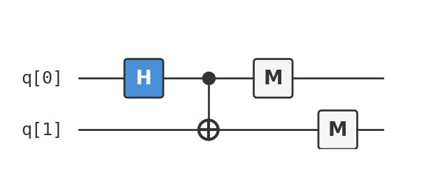

# Recipe 01: The Bell State

## What are we making?

Two qubits that are perfectly correlated — measure one, and you instantly know the other, no matter how far apart they are. This is **entanglement**, the resource that makes quantum teleportation, superdense coding, and most quantum algorithms possible.

It's also the simplest interesting quantum circuit you can build: two gates, two qubits, and a result that has no classical explanation.

## Ingredients

- 2 qubits
- 1 Hadamard gate (`h`)
- 1 CNOT gate (`cx`)
- A [Quokka](https://www.quokkacomputing.com/) (puck or app)

No prior quantum knowledge required. We'll explain everything as we go.

## Background: what does "correlated" mean here?

Flip two classical coins independently. Sometimes they match, sometimes they don't — about 50/50. You could also *cheat* and glue them together so they always match, but then there's no randomness: you know the outcome before you look.

A Bell state gives you **both**: each individual qubit is perfectly random (50% chance of 0 or 1), but they are *always* correlated (both 0 or both 1). This combination — local randomness with perfect global correlation — is impossible classically. It's the signature of entanglement.

## Method

### Step 1: Declare your qubits

Every QASM 2.0 program starts by saying what version of the language we're using and how many qubits and classical bits we need:

```
OPENQASM 2.0;
include "qelib1.inc";

qreg q[2];   // two qubits, both start in state |0⟩
creg c[2];   // two classical bits to store measurement results
```

Both qubits begin in the $|0\rangle$ state. Think of them as two coins, both heads-up.

### Step 2: Create superposition on the first qubit

Apply a **Hadamard gate** to qubit 0:

```
h q[0];
```

This puts qubit 0 into an equal superposition of $|0\rangle$ and $|1\rangle$:

$$|0\rangle \xrightarrow{H} \frac{1}{\sqrt{2}}(|0\rangle + |1\rangle)$$

If you measured right now, you'd get 0 or 1 with equal probability. The coin is spinning in the air.

The two-qubit state is now:

$$\frac{1}{\sqrt{2}}(|0\rangle + |1\rangle) \otimes |0\rangle = \frac{1}{\sqrt{2}}(|00\rangle + |10\rangle)$$

The qubits are still independent — knowing one tells you nothing about the other.

### Step 3: Entangle with a CNOT

Apply a **CNOT** (controlled-NOT) gate, with qubit 0 as control and qubit 1 as target:

```
cx q[0], q[1];
```

CNOT flips the target qubit *if and only if* the control qubit is $|1\rangle$. Since qubit 0 is in superposition, both possibilities happen:

- The $|00\rangle$ branch: control is 0, target stays 0 → $|00\rangle$
- The $|10\rangle$ branch: control is 1, target flips to 1 → $|11\rangle$

The state is now:

$$\frac{1}{\sqrt{2}}(|00\rangle + |11\rangle)$$

This is the **Bell state** $|\Phi^+\rangle$. The qubits are no longer independent. There is no way to write this state as "qubit 0 is in some state AND qubit 1 is in some state" — they are entangled.

### Step 4: Measure

```
measure q[0] -> c[0];
measure q[1] -> c[1];
```

Measurement collapses the superposition. You'll get either `00` or `11`, each with 50% probability. Never `01`, never `10`.

## The complete circuit

Here's the full QASM file — also available as [`bell.qasm`](bell.qasm):

```
OPENQASM 2.0;
include "qelib1.inc";

qreg q[2];
creg c[2];

h q[0];
cx q[0], q[1];

measure q[0] -> c[0];
measure q[1] -> c[1];
```

As a circuit diagram:



## Taste test

Copy the contents of [`bell.qasm`](bell.qasm) and paste it into your Quokka app or load it onto your Quokka puck.

You should see something like:

```
{'00': 0.5, '11': 0.5}
```

Or, if Quokka samples shots:

```
{'00': 512, '11': 488}
```

The exact counts vary (it's random!), but you should see *only* `00` and `11`. If you ever see `01` or `10`, something is wrong.

## Deep dive

??? abstract "Gate matrices and state evolution"

    Every quantum gate is a unitary matrix. Here are the two gates in this recipe, acting on the computational basis $\{|0\rangle, |1\rangle\}$:

    **Hadamard gate:**

    $$H = \frac{1}{\sqrt{2}} \begin{pmatrix} 1 & 1 \\ 1 & -1 \end{pmatrix}$$

    Verify: $H|0\rangle = \frac{1}{\sqrt{2}}\begin{pmatrix}1\\1\end{pmatrix} = \frac{1}{\sqrt{2}}(|0\rangle + |1\rangle)$ and $H|1\rangle = \frac{1}{\sqrt{2}}\begin{pmatrix}1\\-1\end{pmatrix} = \frac{1}{\sqrt{2}}(|0\rangle - |1\rangle)$.

    Note that $H^2 = I$ — the Hadamard is its own inverse. This will be important in Recipe 03.

    **CNOT gate** (in the two-qubit basis $\{|00\rangle, |01\rangle, |10\rangle, |11\rangle\}$):

    $$\text{CNOT} = \begin{pmatrix} 1 & 0 & 0 & 0 \\ 0 & 1 & 0 & 0 \\ 0 & 0 & 0 & 1 \\ 0 & 0 & 1 & 0 \end{pmatrix}$$

    It swaps the amplitudes of $|10\rangle$ and $|11\rangle$ — i.e., it flips the target qubit when the control is $|1\rangle$.

    **Full state evolution as matrix multiplication:**

    The initial state is $|00\rangle = \begin{pmatrix}1\\0\\0\\0\end{pmatrix}$.

    After $H \otimes I$ (Hadamard on qubit 0, identity on qubit 1):

    $$(H \otimes I)|00\rangle = \frac{1}{\sqrt{2}} \begin{pmatrix} 1 & 0 & 1 & 0 \\ 0 & 1 & 0 & 1 \\ 1 & 0 & -1 & 0 \\ 0 & 1 & 0 & -1 \end{pmatrix} \begin{pmatrix}1\\0\\0\\0\end{pmatrix} = \frac{1}{\sqrt{2}} \begin{pmatrix}1\\0\\1\\0\end{pmatrix}$$

    This is $\frac{1}{\sqrt{2}}(|00\rangle + |10\rangle)$, as expected.

    After CNOT:

    $$\text{CNOT} \cdot \frac{1}{\sqrt{2}} \begin{pmatrix}1\\0\\1\\0\end{pmatrix} = \frac{1}{\sqrt{2}} \begin{pmatrix}1\\0\\0\\1\end{pmatrix}$$

    This is $\frac{1}{\sqrt{2}}(|00\rangle + |11\rangle) = |\Phi^+\rangle$. ∎

??? abstract "Why entanglement is not classical correlation — the density matrix view"

    A skeptic might say: "Your Bell state is just a classical coin flip — half the time both are 0, half the time both are 1." We can prove this is wrong using the **reduced density matrix**.

    The density matrix of the Bell state is:

    $$\rho = |\Phi^+\rangle\langle\Phi^+| = \frac{1}{2}\begin{pmatrix} 1 & 0 & 0 & 1 \\ 0 & 0 & 0 & 0 \\ 0 & 0 & 0 & 0 \\ 1 & 0 & 0 & 1 \end{pmatrix}$$

    The **reduced density matrix** of qubit 0 (obtained by tracing out qubit 1) is:

    $$\rho_0 = \text{Tr}_1(\rho) = \frac{1}{2}\begin{pmatrix} 1 & 0 \\ 0 & 1 \end{pmatrix} = \frac{I}{2}$$

    This is the **maximally mixed state** — qubit 0 is completely random, with no preferred direction. The same holds for qubit 1.

    Now consider the classical analogue: a fair coin flip that produces either $|00\rangle$ or $|11\rangle$:

    $$\rho_{\text{classical}} = \frac{1}{2}|00\rangle\langle00| + \frac{1}{2}|11\rangle\langle11| = \frac{1}{2}\begin{pmatrix} 1 & 0 & 0 & 0 \\ 0 & 0 & 0 & 0 \\ 0 & 0 & 0 & 0 \\ 0 & 0 & 0 & 1 \end{pmatrix}$$

    The reduced density matrices are the same! So measuring each qubit individually gives the same statistics. The difference is in the **off-diagonal terms** of the full density matrix — the entries $\rho_{00,11} = \rho_{11,00} = \frac{1}{2}$ in the Bell state. These are the **coherences**, and they have no classical analogue. They encode the fact that the system is in a superposition of $|00\rangle$ and $|11\rangle$, not a mixture.

    These coherences become observable when you measure in a different basis (e.g., the $|+\rangle$/$|{-}\rangle$ basis) — they're what make Bell inequality violations possible.

??? abstract "Bell's theorem and the CHSH inequality"

    In 1964, John Bell proved that no theory based on **local hidden variables** can reproduce all the predictions of quantum mechanics. The most practical version of this result is the **CHSH inequality** (Clauser, Horne, Shimony, Holt, 1969).

    **Setup:** Alice and Bob share a pair of qubits. Each independently chooses one of two measurement settings:

    - Alice measures $A_0$ or $A_1$
    - Bob measures $B_0$ or $B_1$

    Each measurement gives $+1$ or $-1$.

    **The CHSH quantity:**

    $$S = \langle A_0 B_0 \rangle + \langle A_0 B_1 \rangle + \langle A_1 B_0 \rangle - \langle A_1 B_1 \rangle$$

    **Classical bound:** For any local hidden variable theory, $|S| \leq 2$.

    **Quantum prediction:** For the Bell state $|\Phi^+\rangle$ with optimal measurement angles:

    - $A_0 = Z$, $A_1 = X$ (Alice measures in the Z or X basis)
    - $B_0 = \frac{Z + X}{\sqrt{2}}$, $B_1 = \frac{Z - X}{\sqrt{2}}$ (Bob measures at 45°)

    $$S = 2\sqrt{2} \approx 2.828$$

    This **violates** the classical bound. The correlations in a Bell state are stronger than anything achievable with classical shared randomness. This has been confirmed experimentally countless times, most definitively in the 2015 "loophole-free" Bell tests (which led to the 2022 Nobel Prize in Physics for Aspect, Clauser, and Zeilinger).

    The takeaway: when you run this recipe on your Quokka and see only `00` and `11`, you're witnessing correlations that have no classical explanation — not because you haven't thought hard enough, but because Bell proved no classical explanation is possible.

??? abstract "The tensor product formalism"

    When we write $|00\rangle$, this is shorthand for the **tensor product** $|0\rangle \otimes |0\rangle$. Understanding tensor products is key to multi-qubit systems.

    **Definition:** If $|a\rangle = \begin{pmatrix}\alpha_0 \\ \alpha_1\end{pmatrix}$ and $|b\rangle = \begin{pmatrix}\beta_0 \\ \beta_1\end{pmatrix}$, then:

    $$|a\rangle \otimes |b\rangle = \begin{pmatrix}\alpha_0 \beta_0 \\ \alpha_0 \beta_1 \\ \alpha_1 \beta_0 \\ \alpha_1 \beta_1\end{pmatrix}$$

    The two-qubit computational basis is:

    $$|00\rangle = \begin{pmatrix}1\\0\\0\\0\end{pmatrix}, \quad |01\rangle = \begin{pmatrix}0\\1\\0\\0\end{pmatrix}, \quad |10\rangle = \begin{pmatrix}0\\0\\1\\0\end{pmatrix}, \quad |11\rangle = \begin{pmatrix}0\\0\\0\\1\end{pmatrix}$$

    **Separable vs. entangled:** A two-qubit state $|\psi\rangle$ is **separable** if it can be written as $|a\rangle \otimes |b\rangle$ for some single-qubit states $|a\rangle$ and $|b\rangle$. Otherwise it is **entangled**.

    The Bell state $|\Phi^+\rangle = \frac{1}{\sqrt{2}}(|00\rangle + |11\rangle) = \frac{1}{\sqrt{2}}\begin{pmatrix}1\\0\\0\\1\end{pmatrix}$ is entangled.

    **Proof:** Suppose $|\Phi^+\rangle = |a\rangle \otimes |b\rangle = \begin{pmatrix}\alpha_0 \beta_0 \\ \alpha_0 \beta_1 \\ \alpha_1 \beta_0 \\ \alpha_1 \beta_1\end{pmatrix}$. Then:

    - $\alpha_0 \beta_0 = \frac{1}{\sqrt{2}}$ (from the $|00\rangle$ component)
    - $\alpha_0 \beta_1 = 0$ (from $|01\rangle$)
    - $\alpha_1 \beta_0 = 0$ (from $|10\rangle$)
    - $\alpha_1 \beta_1 = \frac{1}{\sqrt{2}}$ (from $|11\rangle$)

    From equation 1, both $\alpha_0$ and $\beta_0$ are nonzero. From equation 2, since $\alpha_0 \neq 0$, we need $\beta_1 = 0$. But then equation 4 gives $\alpha_1 \cdot 0 = \frac{1}{\sqrt{2}}$, which is a contradiction. Therefore $|\Phi^+\rangle$ cannot be written as a product state. ∎

    **Gates on multi-qubit systems:** When a gate $U$ acts on qubit 0 of a two-qubit system, the full operator is $U \otimes I$. When it acts on qubit 1, the full operator is $I \otimes U$. Two-qubit gates like CNOT act on the full 4-dimensional space directly.

??? abstract "The four Bell states as a complete basis"

    The four Bell states form an **orthonormal basis** for the two-qubit Hilbert space $\mathbb{C}^2 \otimes \mathbb{C}^2$:

    $$|\Phi^+\rangle = \frac{1}{\sqrt{2}}(|00\rangle + |11\rangle)$$

    $$|\Phi^-\rangle = \frac{1}{\sqrt{2}}(|00\rangle - |11\rangle)$$

    $$|\Psi^+\rangle = \frac{1}{\sqrt{2}}(|01\rangle + |10\rangle)$$

    $$|\Psi^-\rangle = \frac{1}{\sqrt{2}}(|01\rangle - |10\rangle)$$

    Any two-qubit state can be decomposed in this basis. This is why Bell measurements (projecting onto the Bell basis) are so powerful — they appear in teleportation (Recipe 02), superdense coding, and entanglement swapping.

    **Generating all four from $|\Phi^+\rangle$:** You can obtain any Bell state from $|\Phi^+\rangle$ by applying a single-qubit Pauli gate to the first qubit:

    | Gate on qubit 0 | Resulting state |
    |:---|:---|
    | $I$ (identity) | $\|\Phi^+\rangle$ |
    | $Z$ | $\|\Phi^-\rangle$ |
    | $X$ | $\|\Psi^+\rangle$ |
    | $iY = XZ$ | $\|\Psi^-\rangle$ |

    This relationship is the engine behind superdense coding: Alice encodes two classical bits by applying one of four Pauli operations to her half of a shared Bell pair, then sends it to Bob. Bob performs a Bell measurement to decode the message — two bits transmitted using one qubit.

## Chef's notes

- **Why not just use a classical random number generator?** You could generate two identical random bits classically — but you'd need to either (a) decide the value in advance and copy it, or (b) communicate between the bits. A Bell state has neither: the value is undetermined until measurement, yet always correlated. This distinction matters for cryptography (Bell tests) and is the basis of quantum key distribution.

- **The other Bell states.** There are four Bell states total. You can reach any of them by adding a single gate before the Hadamard. We'll use them all in Recipe 02 (Teleportation).

  | State | Circuit | Result |
  |-------|---------|--------|
  | $\|\Phi^+\rangle$ | `h, cx` | `00` + `11` |
  | $\|\Phi^-\rangle$ | `x, h, cx` | `00` - `11` |
  | $\|\Psi^+\rangle$ | `h, cx, x` on target | `01` + `10` |
  | $\|\Psi^-\rangle$ | `x, h, cx, x` on target | `01` - `10` |

- **If you liked this, try:** Recipe 02 (Teleportation) uses Bell states to transmit quantum information. Recipe 03 (Deutsch-Jozsa) uses the same H + entanglement pattern to solve a problem faster than any classical algorithm.
