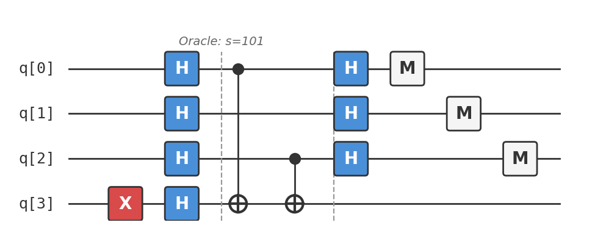

# Recipe 04: Bernstein-Vazirani

## What are we making?

An algorithm that discovers a hidden binary string in a single query. Someone has picked a secret $n$-bit string $s$, and they've given you a black box that computes $f(x) = s \cdot x \mod 2$ — the bitwise inner product of $x$ with $s$. Your job: find $s$.

Classically, you need $n$ queries (one per bit — feed in $100\ldots0$, $010\ldots0$, etc.). The Bernstein-Vazirani algorithm finds all $n$ bits in **one query**. Same circuit structure as Deutsch-Jozsa, deeper question.

## Ingredients

- 4 qubits (3 input + 1 ancilla)
- Hadamard gates (`h`)
- CNOT gates (`cx`)
- 1 X gate (`x`)
- A [Quokka](https://www.quokkacomputing.com/) (puck or app)

**Prerequisites:** [Recipe 03 — Deutsch-Jozsa](../03-deutsch-jozsa/README.md). You should understand phase kickback and the role of the $|{-}\rangle$ ancilla.

## Background: the hidden string problem

Imagine a friend picks a secret binary string — say, $s = 101$. They build a machine: you feed in any 3-bit string $x$, and it returns $s \cdot x \mod 2$:

| Input $x$ | $s \cdot x = 1 \cdot x_0 + 0 \cdot x_1 + 1 \cdot x_2$ | Output $f(x)$ |
|:---|:---|:---|
| $000$ | $0 + 0 + 0$ | $0$ |
| $001$ | $0 + 0 + 1$ | $1$ |
| $010$ | $0 + 0 + 0$ | $0$ |
| $011$ | $0 + 0 + 1$ | $1$ |
| $100$ | $1 + 0 + 0$ | $1$ |
| $101$ | $1 + 0 + 1$ | $0$ |
| $110$ | $1 + 0 + 0$ | $1$ |
| $111$ | $1 + 0 + 1$ | $0$ |

Classically, you'd query $x = 100$ to learn $s_0$, $x = 010$ to learn $s_1$, and $x = 001$ to learn $s_2$. Three queries for three bits. For $n$ bits, $n$ queries.

Quantum mechanically: one query. You ask *all inputs simultaneously* and read $s$ directly from the interference pattern.

## Method

### Step 1: Prepare the ancilla

```
x q[3];
h q[3];
```

Same as Deutsch-Jozsa: put the ancilla in $|{-}\rangle$ so the oracle's bit-flip becomes a phase kickback.

### Step 2: Superposition on input register

```
h q[0];
h q[1];
h q[2];
```

The input register is now:

$$\frac{1}{\sqrt{2^3}} \sum_{x \in \{0,1\}^3} |x\rangle = \frac{1}{2\sqrt{2}}(|000\rangle + |001\rangle + \cdots + |111\rangle)$$

### Step 3: Apply the oracle

For $s = 101$, the oracle computes $f(x) = x_0 \oplus x_2$ (the XOR of the bits where $s$ has a 1):

```
cx q[0], q[3];   // s_0 = 1
// skip q[1]       // s_1 = 0
cx q[2], q[3];   // s_2 = 1
```

Via phase kickback, this marks each computational basis state with $(-1)^{f(x)} = (-1)^{s \cdot x}$:

$$\frac{1}{2\sqrt{2}} \sum_{x} (-1)^{s \cdot x} |x\rangle \otimes |{-}\rangle$$

### Step 4: Apply Hadamard to the input register

```
h q[0];
h q[1];
h q[2];
```

Here's where the magic happens. Recall from the Deutsch-Jozsa deep dive that $H^{\otimes n}|x\rangle = \frac{1}{\sqrt{2^n}} \sum_z (-1)^{x \cdot z}|z\rangle$.

Applying $H^{\otimes 3}$ to the phase-marked state:

$$\sum_z \left[\frac{1}{2^3} \sum_x (-1)^{s \cdot x + x \cdot z}\right] |z\rangle = \sum_z \left[\frac{1}{2^3} \sum_x (-1)^{x \cdot (s \oplus z)}\right] |z\rangle$$

The inner sum $\sum_x (-1)^{x \cdot (s \oplus z)}$ is $2^n$ when $s \oplus z = 0$ (i.e., $z = s$), and $0$ otherwise. This is a standard identity for the Walsh-Hadamard transform.

The state collapses to simply $|s\rangle = |101\rangle$.

### Step 5: Measure

```
measure q[0] -> c[0];
measure q[1] -> c[1];
measure q[2] -> c[2];
```

You read out $101$ with 100% probability. The hidden string is revealed.

## The complete circuit

Available as [`bernstein_vazirani.qasm`](bernstein_vazirani.qasm):

```
OPENQASM 2.0;
include "qelib1.inc";

qreg q[4];
creg c[3];

x q[3];
h q[3];

h q[0];
h q[1];
h q[2];

// Oracle: s = 101
cx q[0], q[3];
cx q[2], q[3];

h q[0];
h q[1];
h q[2];

measure q[0] -> c[0];
measure q[1] -> c[1];
measure q[2] -> c[2];
```

As a circuit diagram:



## Taste test

Paste `bernstein_vazirani.qasm` into your Quokka. You should see:

```
{'101': 1024}
```

The hidden string $s = 101$ is recovered with certainty in one query.

!!! tip "Try different hidden strings"
    Change which CNOT gates are present in the oracle:

    - **$s = 110$:** Use `cx q[0], q[3]` and `cx q[1], q[3]` (skip q[2])
    - **$s = 011$:** Use `cx q[1], q[3]` and `cx q[2], q[3]` (skip q[0])
    - **$s = 111$:** Use all three CNOTs
    - **$s = 000$:** No CNOTs at all → output is $|000\rangle$ (like Deutsch-Jozsa constant)

## Deep dive

??? abstract "Proof of correctness for general $n$"

    For an $n$-bit hidden string $s$, the algorithm proceeds identically:

    1. Prepare $|0\rangle^{\otimes n}|{-}\rangle$
    2. Apply $H^{\otimes n}$ to the input register: $\frac{1}{\sqrt{2^n}}\sum_x |x\rangle \otimes |{-}\rangle$
    3. Oracle: $\frac{1}{\sqrt{2^n}}\sum_x (-1)^{s \cdot x} |x\rangle \otimes |{-}\rangle$
    4. Apply $H^{\otimes n}$: use the identity $H^{\otimes n}\left[\frac{1}{\sqrt{2^n}}\sum_x (-1)^{s \cdot x} |x\rangle\right] = |s\rangle$

    **Proof of the key identity:** We need to show that:

    $$H^{\otimes n}\left[\frac{1}{\sqrt{2^n}}\sum_x (-1)^{s \cdot x} |x\rangle\right] = |s\rangle$$

    Note that $\frac{1}{\sqrt{2^n}}\sum_x (-1)^{s \cdot x} |x\rangle = H^{\otimes n}|s\rangle$ (this is just the definition of the Hadamard transform applied to $|s\rangle$).

    Therefore: $H^{\otimes n} \cdot H^{\otimes n}|s\rangle = |s\rangle$, since $H^{\otimes n}$ is its own inverse. ∎

    The oracle for $f(x) = s \cdot x$ with arbitrary $s$ is simply: for each bit $i$ where $s_i = 1$, apply CNOT from $q[i]$ to the ancilla. This requires at most $n$ CNOT gates, and the full algorithm uses $2n$ Hadamard gates, $n$ CNOTs, one X gate — all executed once. Total gate count: $O(n)$.

??? abstract "Relationship to Deutsch-Jozsa and Fourier sampling"

    Bernstein-Vazirani and Deutsch-Jozsa are both instances of **Fourier sampling** over $\mathbb{Z}_2^n$.

    The general framework:

    1. Encode a function $f$ into phases: $\frac{1}{\sqrt{2^n}}\sum_x (-1)^{f(x)}|x\rangle$
    2. Apply $H^{\otimes n}$ (the Fourier transform over $\mathbb{Z}_2^n$)
    3. Measure

    The measurement outcome samples from the Fourier spectrum of $(-1)^{f(x)}$.

    | Algorithm | $f(x)$ | What the Fourier spectrum reveals |
    |:---|:---|:---|
    | Deutsch-Jozsa | Constant or balanced | All weight on $0^n$ (constant) vs. zero weight on $0^n$ (balanced) |
    | Bernstein-Vazirani | $s \cdot x$ for hidden $s$ | All weight on $s$ (a delta function in Fourier space) |
    | Simon's (Recipe 05) | $f(x) = f(x \oplus s)$ | Uniform over $s^\perp$ (the subspace orthogonal to $s$) |

    Bernstein-Vazirani is the "sharpest" case: the hidden string $s$ is literally a single Fourier coefficient, so one Fourier sample gives it exactly.

    This perspective also explains why the classical lower bound is $n$: each classical query gives one bit of information about $s$ (the result of $s \cdot x$ for a chosen $x$). You need $n$ independent equations to solve for $n$ unknowns. The quantum algorithm gets all $n$ bits in one shot because the Fourier transform is a global operation.

??? abstract "Connection to linear algebra over $\mathbb{F}_2$"

    The function $f(x) = s \cdot x \mod 2$ is a **linear function** over the finite field $\mathbb{F}_2$. The hidden string $s$ defines a linear functional $\mathbb{F}_2^n \to \mathbb{F}_2$.

    Finding $s$ is equivalent to solving a system of linear equations over $\mathbb{F}_2$:

    $$\begin{pmatrix} x_1 \\ x_2 \\ \vdots \\ x_n \end{pmatrix} \cdot s = \begin{pmatrix} f(x_1) \\ f(x_2) \\ \vdots \\ f(x_n) \end{pmatrix}$$

    Classically, you need $n$ linearly independent queries (the rows must span $\mathbb{F}_2^n$). The standard basis vectors $e_1, \ldots, e_n$ work, giving $s_i = f(e_i)$.

    Quantum mechanically, the Hadamard transform simultaneously queries all $2^n$ inputs and extracts the full solution from the interference pattern. The "linear independence" requirement is replaced by the orthogonality of the Walsh-Hadamard basis functions.

    This $\mathbb{F}_2$ linear algebra perspective becomes crucial in Simon's algorithm (Recipe 05), where you're finding a hidden *subgroup* rather than a single vector.

??? abstract "The oracle circuit: why CNOT is the right gate"

    The oracle for $f(x) = s \cdot x$ needs to compute $|x\rangle|y\rangle \to |x\rangle|y \oplus (s \cdot x)\rangle$.

    Since $s \cdot x = \bigoplus_{i: s_i = 1} x_i$, the oracle flips the ancilla once for each '1' bit in $s$ where the corresponding input bit is also 1. Each such conditional flip is exactly a CNOT gate.

    The fact that XOR is associative means the CNOTs commute — their order doesn't matter. The circuit has depth 1 if all CNOTs can execute in parallel, or depth $|s|$ (the Hamming weight of $s$) sequentially.

    This is the simplest possible oracle structure, which is why Bernstein-Vazirani is the cleanest demonstration of the general Fourier sampling paradigm.

## Chef's notes

- **Classical query complexity.** A deterministic classical algorithm needs exactly $n$ queries; each query $x = e_i$ reveals one bit $s_i$. A randomised classical algorithm also needs $\Omega(n)$ queries (with bounded error). The quantum advantage here is a polynomial $n \to 1$ speedup, not exponential — but it's *exact* (zero error, one query).

- **Deutsch-Jozsa was the warm-up.** Deutsch-Jozsa asks "is $s = 0^n$ or not?" — a single yes/no question about $s$. Bernstein-Vazirani asks "what *is* $s$?" — recovering the full string. Same circuit, more information extracted.

- **Try building your own oracle.** Pick any 3-bit string, wire up the corresponding CNOTs, and verify the algorithm finds it. This is the best way to build intuition for how the oracle structure maps to the measurement outcome.

- **If you liked this, try:** Recipe 05 (Simon's Problem) tackles a harder version: the hidden string $s$ defines a *period* in the function ($f(x) = f(x \oplus s)$), and one Fourier sample isn't enough — you need $O(n)$ samples from the orthogonal subspace. It's the bridge to Shor's algorithm.
