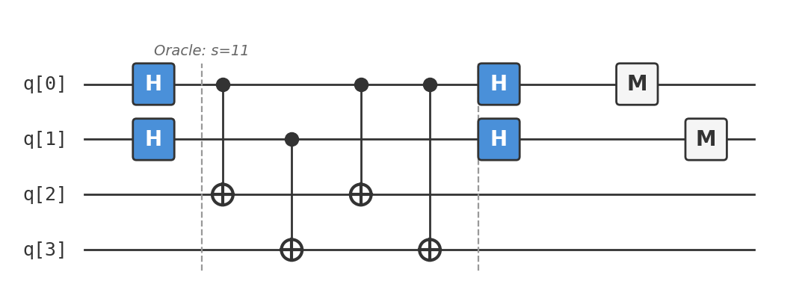

# Recipe 05: Simon's Problem

## What are we making?

An algorithm that finds a hidden period in a function — with exponentially fewer queries than any classical algorithm. You're given a black-box function $f: \{0,1\}^n \to \{0,1\}^n$ with the promise that there exists a secret string $s$ such that $f(x) = f(y)$ if and only if $x = y$ or $x = y \oplus s$. Your job: find $s$.

Classically, this requires $\Omega(2^{n/2})$ queries (birthday paradox). Simon's algorithm solves it in $O(n)$ quantum queries. This is the first **exponential** quantum speedup that works even against randomised classical algorithms, and it's the conceptual ancestor of Shor's factoring algorithm.

## Ingredients

- 4 qubits (2 input + 2 output)
- Hadamard gates (`h`)
- CNOT gates (`cx`)
- A [Quokka](https://www.quokkacomputing.com/) (puck or app)

**Prerequisites:** [Recipe 04 — Bernstein-Vazirani](../04-bernstein-vazirani/README.md). You should understand Fourier sampling and the inner-product oracle.

## Background: hidden periods

Imagine a function that takes 2-bit inputs and produces 2-bit outputs, with a twist: every output value appears exactly twice, and the two inputs that produce the same output always differ by the same secret string $s$.

For $s = 11$:

| Input $x$ | Output $f(x)$ |
|:---|:---|
| $00$ | $00$ |
| $01$ | $01$ |
| $10$ | $01$ |
| $11$ | $00$ |

Notice: $f(00) = f(11)$ and $00 \oplus 11 = 11 = s$. Similarly, $f(01) = f(10)$ and $01 \oplus 10 = 11 = s$.

**Classically:** You'd query random inputs hoping to find a collision ($f(x) = f(y)$ with $x \neq y$). By the birthday paradox, this takes $O(2^{n/2})$ queries. For $n = 2$ that's just ~2, but for $n = 100$ it's $\sim 2^{50}$ — a trillion queries.

**Quantum:** Each run of Simon's algorithm produces a random string $z$ satisfying $s \cdot z = 0 \mod 2$. After $O(n)$ runs, you have enough linear equations to solve for $s$ by Gaussian elimination.

## Method

### Step 1: Superposition on the input register

```
h q[0];
h q[1];
```

$$\frac{1}{2}(|00\rangle + |01\rangle + |10\rangle + |11\rangle) \otimes |00\rangle$$

### Step 2: Apply the oracle

The oracle computes $f(x)$ into the output register:

```
// Copy input to output
cx q[0], q[2];
cx q[1], q[3];
// Add period structure: XOR with s=11 when q[0]=1
cx q[0], q[2];
cx q[0], q[3];
```

After the oracle, the state is:

$$\frac{1}{2}(|00\rangle|00\rangle + |01\rangle|01\rangle + |10\rangle|01\rangle + |11\rangle|00\rangle)$$

Group by output value:

$$\frac{1}{2}\big[(|00\rangle + |11\rangle)|00\rangle + (|01\rangle + |10\rangle)|01\rangle\big]$$

Each output value is paired with two input values that differ by $s = 11$.

### Step 3: Apply Hadamard to the input register

```
h q[0];
h q[1];
```

We don't measure the output register — it's been entangled with the input, effectively collapsing the input to a superposition of $|x\rangle + |x \oplus s\rangle$ for some random $x$. The Hadamard then converts this into a measurement over strings $z$ satisfying $s \cdot z = 0$.

For the pair $|00\rangle + |11\rangle$:

$$H^{\otimes 2}\left[\frac{1}{\sqrt{2}}(|00\rangle + |11\rangle)\right] = \frac{1}{\sqrt{2}}(|00\rangle + |11\rangle)$$

For the pair $|01\rangle + |10\rangle$:

$$H^{\otimes 2}\left[\frac{1}{\sqrt{2}}(|01\rangle + |10\rangle)\right] = \frac{1}{\sqrt{2}}(|00\rangle - |11\rangle)$$

!!! info "Why only $s \cdot z = 0$?"
    In general, $H^{\otimes n}\left[\frac{1}{\sqrt{2}}(|x\rangle + |x \oplus s\rangle)\right]$ has nonzero amplitude only for $|z\rangle$ with $s \cdot z = 0$. This is because the two terms $(-1)^{x \cdot z}$ and $(-1)^{(x \oplus s) \cdot z} = (-1)^{x \cdot z + s \cdot z}$ add constructively when $s \cdot z = 0$ and cancel when $s \cdot z = 1$.

### Step 4: Measure the input register

```
measure q[0] -> c[0];
measure q[1] -> c[1];
```

You get a random $z$ from the set $\{z : s \cdot z = 0 \mod 2\}$.

For $s = 11$: $z_0 \oplus z_1 = 0$, so the valid strings are $\{00, 11\}$. You measure one of these with equal probability.

### Repeat and solve

Run the circuit multiple times. Each run gives an independent equation $s \cdot z_i = 0$. After collecting $n - 1$ linearly independent equations, solve by **Gaussian elimination** over $\mathbb{F}_2$ to find $s$.

For our $n = 2$ example: one sample of $z = 11$ gives $s_0 \oplus s_1 = 0$. Combined with the promise $s \neq 00$, this gives $s = 11$.

## The complete circuit

Available as [`simons.qasm`](simons.qasm):

```
OPENQASM 2.0;
include "qelib1.inc";

qreg q[4];
creg c[2];

h q[0];
h q[1];

// Oracle: f with period s = 11
cx q[0], q[2];
cx q[1], q[3];
cx q[0], q[2];
cx q[0], q[3];

h q[0];
h q[1];

measure q[0] -> c[0];
measure q[1] -> c[1];
```

As a circuit diagram:



## Taste test

Paste `simons.qasm` into your Quokka. You should see:

```
{'00': ~512, '11': ~512}
```

Only $00$ and $11$ appear — both satisfy $s \cdot z = 0$ for $s = 11$. You never see $01$ or $10$.

From the non-trivial sample $z = 11$: $s_0 \oplus s_1 = 0 \Rightarrow s = 11$. ✓

## Deep dive

??? abstract "Why the output register doesn't need to be measured"

    A subtle point: we never explicitly measure the output register `q[2..3]`. Why does the algorithm still work?

    After the oracle, the state is entangled between input and output:

    $$\frac{1}{2}\sum_x |x\rangle|f(x)\rangle$$

    When we measure only the input register, the output register is implicitly "measured" by decoherence — the environment effectively traces it out. Mathematically, the reduced state of the input register after tracing out the output is:

    $$\rho_{\text{in}} = \frac{1}{2^n} \sum_x |x\rangle\langle x| + \frac{1}{2^n} \sum_{x} |x\rangle\langle x \oplus s| + |x \oplus s\rangle\langle x|$$

    After applying $H^{\otimes n}$ and measuring, the distribution over $z$ is uniform over $\{z : s \cdot z = 0\}$. The output register acts as a "which-pair" marker that groups inputs into cosets $\{x, x \oplus s\}$, but the specific pairing doesn't affect the measurement statistics on the input.

    In fact, you *could* measure the output register first — it would collapse the input to a uniform superposition over a specific coset $\{x_0, x_0 \oplus s\}$ — and the Hadamard + measurement would still give a random $z \in s^\perp$. The two approaches are equivalent, but not measuring the output is simpler.

??? abstract "The classical lower bound: $\Omega(2^{n/2})$"

    **Theorem (Simon, 1994):** Any classical probabilistic algorithm that solves Simon's problem with constant success probability requires $\Omega(2^{n/2})$ queries.

    **Proof sketch:** The problem reduces to finding a collision in $f$. Before finding a collision, each query $f(x_i)$ gives a value that (with high probability) hasn't been seen before. The probability of a collision increases only when you've queried enough distinct inputs that some pair collides.

    By the birthday paradox, the expected number of queries before a collision is $\Theta(\sqrt{2^n}) = \Theta(2^{n/2})$.

    More precisely, after $q$ queries, the probability of having found at least one collision is at most $\binom{q}{2} / 2^n \approx q^2 / 2^{n+1}$. For this to be $\geq 1/2$, you need $q \geq \Omega(2^{n/2})$.

    The quantum algorithm needs $O(n)$ queries — an exponential improvement. For $n = 100$: classical ~$10^{15}$ queries vs. quantum ~$100$ queries.

??? abstract "From Simon to Shor: the hidden subgroup framework"

    Simon's algorithm is the first algorithm to achieve an exponential quantum speedup over all classical algorithms (including randomised ones). It directly inspired Peter Shor's factoring algorithm (1994).

    Both algorithms fit the **Hidden Subgroup Problem (HSP)** framework:

    | Problem | Group $G$ | Hidden subgroup $H$ | Oracle |
    |:---|:---|:---|:---|
    | Simon's | $\mathbb{Z}_2^n$ | $\{0, s\}$ | $f(x) = f(x \oplus s)$ |
    | Shor's factoring | $\mathbb{Z}$ | $r\mathbb{Z}$ (multiples of period $r$) | $f(x) = a^x \mod N$ |

    **The pattern:**

    1. Create a superposition over $G$
    2. Query the oracle (which is constant on cosets of $H$)
    3. Apply the Fourier transform over $G$
    4. Measure → get a random element of $H^\perp$ (the dual subgroup)
    5. Collect enough samples and solve classically

    For Simon's: $G = \mathbb{Z}_2^n$, the Fourier transform is $H^{\otimes n}$, and $H^\perp = s^\perp$.

    For Shor's: $G = \mathbb{Z}_N$, the Fourier transform is the QFT, and $H^\perp$ gives multiples of $N/r$ (from which $r$ can be extracted via continued fractions).

    The transition from Simon to Shor is essentially: replace $\mathbb{Z}_2^n$ with $\mathbb{Z}_N$. We'll build the QFT in Recipe 09.

??? abstract "Gaussian elimination over $\mathbb{F}_2$"

    Each run of Simon's algorithm gives a random equation $s \cdot z = 0 \mod 2$. After $k$ runs, you have a system:

    $$\begin{pmatrix} z_1 \\ z_2 \\ \vdots \\ z_k \end{pmatrix} s = \begin{pmatrix} 0 \\ 0 \\ \vdots \\ 0 \end{pmatrix} \pmod{2}$$

    To determine $s$ uniquely (up to the trivial solution $s = 0$), you need $n - 1$ linearly independent rows.

    **How many runs?** Each sample $z$ is uniformly random over $s^\perp$, which has dimension $n - 1$. The probability that $k$ random samples span $s^\perp$ is:

    $$\prod_{i=0}^{n-2}\left(1 - \frac{1}{2^{n-1-i}}\right) \geq \prod_{i=1}^{\infty}\left(1 - \frac{1}{2^i}\right) \approx 0.2888$$

    after $n - 1$ samples. In practice, $n + O(1)$ samples suffice with overwhelming probability. For $n = 2$, one non-trivial sample is enough (and it appears with probability 1/2 each run). For $n = 100$, ~$105$ samples virtually guarantee success.

    The Gaussian elimination step is classical and runs in $O(n^3)$ time — negligible compared to the oracle queries.

## Chef's notes

- **This is the first exponential quantum speedup that beats randomness.** Deutsch-Jozsa and Bernstein-Vazirani beat *deterministic* classical algorithms but can be matched by randomised ones (up to constant factors). Simon's algorithm beats everything classical by an exponential factor. This is what made the community take quantum computing seriously.

- **The algorithm isn't deterministic.** Unlike Deutsch-Jozsa and Bernstein-Vazirani, you need to run the circuit multiple times and do classical post-processing. This "sample and solve" pattern is how most practical quantum algorithms work.

- **Building the oracle is non-trivial.** For our 2-bit example, the oracle is simple. For general $n$-bit periods, constructing the oracle circuit is itself a design challenge. In the theoretical setting, the oracle is given as a black box.

- **If you liked this, try:** Recipe 06 (Grover's Search) takes a completely different approach — amplitude amplification rather than Fourier sampling — to achieve a quadratic speedup on unstructured search. Recipe 09 (QFT) builds the Fourier transform over $\mathbb{Z}_N$ that generalises the Hadamard-based approach used here.
