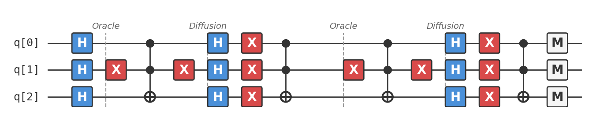

# Recipe 06: Grover's Search

## What are we making?

An algorithm that finds a needle in a haystack — quadratically faster than checking every straw. Given a list of $N = 2^n$ items and a black-box function that recognises the target, Grover's algorithm finds it in $O(\sqrt{N})$ queries instead of the classical $O(N)$.

For 3 qubits ($N = 8$), a classical search needs up to 8 guesses. Grover's needs 2. For $n = 20$ ($N \approx$ 1 million), classical needs ~500,000 guesses on average; Grover's needs ~785.

This isn't an exponential speedup (that was Simon's), but it's **universal** — it applies to *any* search problem, with no structural assumptions about the function. And it's provably optimal: no quantum algorithm can do unstructured search faster than $O(\sqrt{N})$.

## Ingredients

- 3 qubits
- Hadamard gates (`h`)
- X gates (`x`)
- Toffoli gate (`ccx`)
- A [Quokka](https://www.quokkacomputing.com/) (puck or app)

**Prerequisites:** [Recipe 03 — Deutsch-Jozsa](../03-deutsch-jozsa/README.md) for phase kickback, and comfort with multi-qubit gates.

## Background: searching without structure

All previous recipes exploited *structure* in the oracle — linearity (Bernstein-Vazirani), periodicity (Simon). Grover's algorithm assumes nothing. The oracle is a black box:

$$O|x\rangle = (-1)^{f(x)}|x\rangle$$

where $f(x) = 1$ for the target and $f(x) = 0$ for everything else. No patterns, no shortcuts — just a single marked item hidden among $N$ possibilities.

The classical approach is brute force: check items one by one. On average, you need $N/2$ queries.

Grover's approach: start in a uniform superposition, then repeatedly **amplify** the amplitude of the correct answer while **suppressing** the wrong ones. After about $\frac{\pi}{4}\sqrt{N}$ iterations, the target has nearly all the probability.

## Method

### Step 1: Create uniform superposition

```
h q[0];
h q[1];
h q[2];
```

$$|\psi\rangle = \frac{1}{\sqrt{8}} \sum_{x=0}^{7} |x\rangle$$

Every item has equal amplitude $\frac{1}{\sqrt{8}} \approx 0.354$ and equal probability $\frac{1}{8} = 12.5\%$.

### Step 2: The Grover iteration (repeat twice)

Each iteration consists of two parts: the **oracle** and the **diffusion operator**.

#### Part A: Oracle — mark the target

Our target is $|101\rangle$. The oracle flips its phase:

```
x q[1];              // flip q[1] (because target has q[1]=0)
h q[2];
ccx q[0], q[1], q[2];  // Toffoli gate
h q[2];
x q[1];              // unflip q[1]
```

The Toffoli (CCX) gate flips q[2] when both q[0] and q[1] are 1. By flipping q[1] first (so $0 \to 1$), we make it trigger on the pattern $q[0]=1, q[1]=0, q[2]=$ anything. The H-CCX-H sandwich on q[2] converts the bit-flip to a phase-flip (same phase kickback trick from earlier recipes).

After the oracle, the state is the same as before except $|101\rangle$ has a negative sign.

#### Part B: Diffusion — amplify the target

The diffusion operator reflects the state about the mean amplitude:

```
h q[0]; h q[1]; h q[2];
x q[0]; x q[1]; x q[2];
h q[2];
ccx q[0], q[1], q[2];
h q[2];
x q[0]; x q[1]; x q[2];
h q[0]; h q[1]; h q[2];
```

This implements $2|\psi\rangle\langle\psi| - I$, where $|\psi\rangle = H^{\otimes n}|0\rangle^{\otimes n}$ is the uniform superposition.

**What it does geometrically:** The oracle flipped the target's amplitude below the mean. The diffusion operator reflects everything about the mean, pushing the target's amplitude *above* the mean and suppressing the non-targets below. Each iteration increases the gap.

### Why 2 iterations?

For $N = 8$ and 1 marked item, the optimal number of iterations is:

$$k = \left\lfloor \frac{\pi}{4}\sqrt{N} \right\rfloor = \left\lfloor \frac{\pi}{4}\sqrt{8} \right\rfloor = \left\lfloor 2.22 \right\rfloor = 2$$

After 2 iterations, the target has probability $\sin^2\left(\frac{2 \cdot 2 + 1}{2} \cdot \sin^{-1}\frac{1}{\sqrt{8}}\right) \approx 0.945$ — about 94.5%.

### Step 3: Measure

```
measure q[0] -> c[0];
measure q[1] -> c[1];
measure q[2] -> c[2];
```

With ~94.5% probability, you get $101$. If not, run again — two attempts give 99.7% cumulative success.

## The complete circuit

Available as [`grovers.qasm`](grovers.qasm):

```
OPENQASM 2.0;
include "qelib1.inc";

qreg q[3];
creg c[3];

h q[0];
h q[1];
h q[2];

// === Grover iteration 1 ===
// Oracle: mark |101⟩
x q[1];
h q[2];
ccx q[0], q[1], q[2];
h q[2];
x q[1];

// Diffusion operator
h q[0]; h q[1]; h q[2];
x q[0]; x q[1]; x q[2];
h q[2];
ccx q[0], q[1], q[2];
h q[2];
x q[0]; x q[1]; x q[2];
h q[0]; h q[1]; h q[2];

// === Grover iteration 2 ===
// Oracle: mark |101⟩
x q[1];
h q[2];
ccx q[0], q[1], q[2];
h q[2];
x q[1];

// Diffusion operator
h q[0]; h q[1]; h q[2];
x q[0]; x q[1]; x q[2];
h q[2];
ccx q[0], q[1], q[2];
h q[2];
x q[0]; x q[1]; x q[2];
h q[0]; h q[1]; h q[2];

measure q[0] -> c[0];
measure q[1] -> c[1];
measure q[2] -> c[2];
```

The full circuit with both iterations and labeled Oracle/Diffusion sections:



## Taste test

Paste `grovers.qasm` into your Quokka. You should see something like:

```
{'101': 968, '000': 8, '001': 8, '010': 8, '011': 8, '100': 8, '110': 8, '111': 8}
```

The target $|101\rangle$ dominates with ~94.5% of the shots. The other 7 states share the remaining ~5.5%.

!!! tip "Try different targets"
    To search for a different state, change the oracle:

    - **$|000\rangle$:** Remove both X gates around the Toffoli (or use X on all three qubits)
    - **$|111\rangle$:** Remove the X on q[1] — the Toffoli naturally triggers on all-1s
    - **$|011\rangle$:** Apply X to q[0] instead of q[1] before/after the Toffoli

    The diffusion operator stays the same regardless of the target.

## Deep dive

??? abstract "Geometric interpretation: rotations in a 2D plane"

    The deepest way to understand Grover's algorithm is geometrically.

    Define two states:

    - $|w\rangle$ = the target state (the "winner")
    - $|w^\perp\rangle$ = the uniform superposition over all non-target states, normalised

    The initial state $|\psi\rangle = \frac{1}{\sqrt{N}}\sum_x |x\rangle$ lives in the 2D plane spanned by $|w\rangle$ and $|w^\perp\rangle$:

    $$|\psi\rangle = \sin\theta \, |w\rangle + \cos\theta \, |w^\perp\rangle$$

    where $\sin\theta = \frac{1}{\sqrt{N}}$ (the initial amplitude of the target).

    **The oracle** $O = I - 2|w\rangle\langle w|$ reflects the state about $|w^\perp\rangle$.

    **The diffusion** $D = 2|\psi\rangle\langle\psi| - I$ reflects the state about $|\psi\rangle$.

    **Two reflections = a rotation.** Each Grover iteration rotates the state by $2\theta$ towards $|w\rangle$. After $k$ iterations:

    $$G^k|\psi\rangle = \sin((2k+1)\theta) \, |w\rangle + \cos((2k+1)\theta) \, |w^\perp\rangle$$

    The probability of measuring $|w\rangle$ is $\sin^2((2k+1)\theta)$. This is maximised when $(2k+1)\theta \approx \frac{\pi}{2}$, giving:

    $$k_{\text{opt}} = \left\lfloor \frac{\pi}{4\theta} \right\rfloor \approx \left\lfloor \frac{\pi}{4} \sqrt{N} \right\rfloor$$

    For $N = 8$: $\theta = \arcsin(1/\sqrt{8}) \approx 0.3614$, so $k_{\text{opt}} = \lfloor 2.22 \rfloor = 2$, and $\sin^2(5 \times 0.3614) \approx 0.945$.

    **Too many iterations is bad!** If you overshoot, the rotation goes past $|w\rangle$ and the probability decreases. Grover's algorithm has a "sweet spot" and you need to know (or estimate) the number of solutions to choose $k$ correctly. Recipe 12 (Quantum Counting) addresses this.

??? abstract "The diffusion operator as reflection about the mean"

    The diffusion operator $D = 2|\psi\rangle\langle\psi| - I$ has a nice interpretation in terms of amplitudes.

    Let the current state be $|\phi\rangle = \sum_x \alpha_x |x\rangle$ with mean amplitude $\bar{\alpha} = \frac{1}{N}\sum_x \alpha_x$. Then:

    $$D|\phi\rangle = \sum_x (2\bar{\alpha} - \alpha_x)|x\rangle$$

    Each amplitude is reflected about the mean: if $\alpha_x < \bar{\alpha}$, it gets pushed above; if $\alpha_x > \bar{\alpha}$, it gets pushed below.

    **After the oracle:** the target has amplitude $-\frac{1}{\sqrt{N}}$ (negative), while non-targets have $+\frac{1}{\sqrt{N}}$. The mean is approximately $\frac{1}{\sqrt{N}}(1 - \frac{2}{N})$.

    **After diffusion:** the target's amplitude increases to approximately $\frac{3}{\sqrt{N}}$, while non-targets decrease slightly. Each iteration transfers probability from non-targets to the target.

    **Why the circuit implements $2|\psi\rangle\langle\psi| - I$:**

    $$D = H^{\otimes n} \cdot (2|0\rangle\langle 0| - I) \cdot H^{\otimes n}$$

    Since $|\psi\rangle = H^{\otimes n}|0^n\rangle$, conjugating the $|0\rangle\langle 0|$ reflection by $H^{\otimes n}$ gives the $|\psi\rangle\langle\psi|$ reflection. The circuit `H, X, (controlled-Z), X, H` implements $2|0\rangle\langle 0| - I$ because the X gates convert $|0^n\rangle$ to $|1^n\rangle$, and the multi-controlled Z flips the phase of $|1^n\rangle$ only.

??? abstract "Optimality: the BBBV lower bound"

    **Theorem (Bennett, Bernstein, Brassard, Vazirani, 1997):** Any quantum algorithm that solves unstructured search with $N$ items and $M$ solutions requires $\Omega(\sqrt{N/M})$ queries.

    Grover's algorithm achieves $O(\sqrt{N/M})$, so it is **asymptotically optimal**.

    **Proof idea:** The "hybrid method" or "polynomial method." Consider two oracles that differ on a single item. After $T$ queries, the quantum states produced by the two oracles have overlap at least $1 - O(T/\sqrt{N})$. To distinguish them (and thus find the marked item), you need $T = \Omega(\sqrt{N})$.

    This means:

    - No quantum algorithm can do better than $\sqrt{N}$ for unstructured search
    - The quadratic speedup is the best possible without additional structure
    - Quantum computers cannot solve NP-complete problems in polynomial time using Grover's alone (since $\sqrt{2^n}$ is still exponential)

    This last point is sometimes misunderstood: Grover gives a square root speedup, not a polynomial-to-polynomial one. It makes NP problems *faster* but not *easy*.

??? abstract "Multiple solutions and unknown number of targets"

    If there are $M$ solutions among $N$ items, the optimal number of iterations is $\frac{\pi}{4}\sqrt{N/M}$.

    The geometric picture still works: the initial overlap with the "winners subspace" is $\sin\theta = \sqrt{M/N}$ (instead of $1/\sqrt{N}$), so the rotation angle is larger and fewer iterations are needed.

    **But what if you don't know $M$?** You can't choose the optimal $k$ without knowing $\sin\theta$.

    **Solution 1: Exponential search.** Try $k = 1, 2, 4, 8, \ldots$. For each $k$, pick a random multiplier $\lambda \in [1, 4/3]$ and run $\lfloor \lambda k \rfloor$ iterations. This finds a solution in $O(\sqrt{N/M})$ total queries even without knowing $M$. (Boyer, Brassard, Høyer, Tapp, 1998.)

    **Solution 2: Quantum Counting.** Use Recipe 10 (QPE) on the Grover operator to estimate $\theta$ directly, giving you $M$ without searching. Then run Grover's with the right $k$. See Recipe 12.

??? abstract "The oracle as a phase oracle: implementation patterns"

    In this recipe, we build the oracle for $|101\rangle$ using a Toffoli gate. Here's the general pattern for marking an arbitrary $n$-qubit target $|t\rangle$:

    1. For each qubit $i$ where $t_i = 0$: apply X before and after the multi-controlled-Z
    2. Apply a multi-controlled-Z gate (which flips the phase of $|1\rangle^{\otimes n}$)

    The multi-controlled-Z on $n$ qubits can be decomposed into Toffoli + CNOT gates using $O(n)$ ancilla qubits, or $O(n^2)$ basic gates without ancillas.

    **For practical problems**, the oracle isn't built from the target string (that would mean you already know the answer). Instead, it encodes a *verification function* — for example:

    - **SAT solving:** The oracle checks if an assignment satisfies a Boolean formula
    - **Cryptography:** The oracle checks if a key produces a known ciphertext
    - **Optimization:** The oracle checks if a solution meets a threshold

    In each case, building the oracle circuit is the hard part; Grover's amplification machinery is the same regardless.

## Chef's notes

- **Quadratic, not exponential.** Grover gives $\sqrt{N}$ instead of $N$ — a square root speedup. For $N = 10^6$, that's 1000 vs. 500,000. Significant, but not the same league as Simon/Shor's exponential speedups.

- **Don't iterate too much!** Unlike classical search (where more tries always help), Grover's has an optimal stopping point. Overshoot and the probability of the target *decreases*. This is the quantum analogue of a pendulum swinging past the bottom.

- **The Toffoli gate.** The CCX (Toffoli) gate flips the target qubit if *both* controls are 1. It's the quantum AND gate and a universal building block for reversible computation. We use it here to mark a specific 3-qubit state.

- **If you liked this, try:** Recipe 07 (QAOA) uses a different strategy for combinatorial optimization — variational rather than exact. Recipe 12 (Quantum Counting) combines Grover with QPE to count solutions without finding them.
