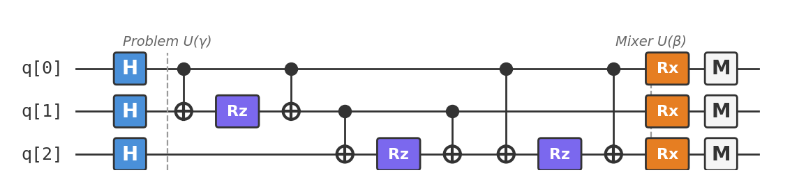

# Recipe 07: QAOA for MaxCut

## What are we making?

A **variational quantum algorithm** that finds approximate solutions to a combinatorial optimization problem. Given a graph, the **Maximum Cut (MaxCut)** problem asks: partition the nodes into two groups to maximise the number of edges between the groups.

MaxCut is NP-hard in general, but the **Quantum Approximate Optimization Algorithm (QAOA)** — proposed by Farhi, Goldstone, and Gutmann in 2014 — gives a quantum-classical hybrid approach. The quantum computer prepares a state encoding candidate solutions; the classical computer tunes the parameters to improve solution quality. Repeat until convergence.

This is the first recipe where we use **parameterised gates** and a **classical optimization loop**. Welcome to the variational era.

## Ingredients

- 3 qubits (one per graph node)
- Hadamard gates (`h`)
- CNOT gates (`cx`)
- RZ gates (`rz`) — parameterised Z-rotations
- RX gates (`rx`) — parameterised X-rotations
- A [Quokka](https://www.quokkacomputing.com/) (puck or app)

**Prerequisites:** [Recipe 01 — Bell State](../01-bell-state/README.md) for CNOT basics, and general comfort with quantum circuits. No previous optimization knowledge needed.

## Background: MaxCut on a Triangle

Consider a triangle graph — three nodes, each pair connected:

```
    0
   / \
  /   \
 1─────2
```

A **cut** partitions the nodes into two groups. The **cut value** is the number of edges between the groups. For a triangle:

| Partition | Groups | Edges cut | Value |
|:---|:---|:---|:---|
| 000 | All together | None | 0 |
| 001 | {0,1} vs {2} | (0,2), (1,2) | 2 |
| 010 | {0,2} vs {1} | (0,1), (1,2) | 2 |
| 011 | {0} vs {1,2} | (0,1), (0,2) | 2 |
| 100 | {1,2} vs {0} | (0,1), (0,2) | 2 |
| 101 | {0,2} vs {1} | (0,1), (1,2) | 2 |
| 110 | {0,1} vs {2} | (0,2), (1,2) | 2 |
| 111 | All together | None | 0 |

The maximum cut is **2** (achieved by any partition that puts one node alone). QAOA's job is to find one of these 6 optimal solutions.

## How QAOA works

QAOA alternates between two unitaries, each controlled by a tunable parameter:

1. **Problem unitary** $U_C(\gamma) = e^{-i\gamma C}$: encodes the MaxCut objective. Edges with endpoints in different groups accumulate phase.

2. **Mixer unitary** $U_M(\beta) = e^{-i\beta B}$: encourages exploration by rotating qubits in the X basis.

Starting from a uniform superposition $|+\rangle^{\otimes n}$, the QAOA ansatz at depth $p$ is:

$$|\gamma, \beta\rangle = U_M(\beta_p) U_C(\gamma_p) \cdots U_M(\beta_1) U_C(\gamma_1) |+\rangle^{\otimes n}$$

A classical optimizer adjusts $\gamma$ and $\beta$ to maximize $\langle\gamma, \beta|C|\gamma, \beta\rangle$ — the expected cut value.

## Method

We'll run QAOA with $p = 1$ (one layer) on the triangle graph, using pre-optimized parameters $\gamma = \pi/4$ and $\beta = \pi/8$.

### Step 1: Initial superposition

```
h q[0];
h q[1];
h q[2];
```

Equal superposition over all $2^3 = 8$ possible partitions.

### Step 2: Problem unitary

For each edge $(i, j)$, we implement $e^{-i\gamma Z_i Z_j}$ using a CNOT-RZ-CNOT sandwich:

```
// Edge (0,1)
cx q[0], q[1];
rz(0.7854) q[1];    // γ = π/4 ≈ 0.7854
cx q[0], q[1];

// Edge (1,2)
cx q[1], q[2];
rz(0.7854) q[2];
cx q[1], q[2];

// Edge (0,2)
cx q[0], q[2];
rz(0.7854) q[2];
cx q[0], q[2];
```

!!! info "Why CNOT-RZ-CNOT implements $e^{-i\\gamma Z_i Z_j}$"
    The CNOT maps the $Z_i Z_j$ interaction to a single-qubit $Z_j$ rotation (because CNOT computes parity). The RZ applies the rotation. The second CNOT uncomputes the parity. Net effect: a phase that depends on whether qubits $i$ and $j$ agree or disagree — exactly what MaxCut needs.

### Step 3: Mixer unitary

Apply $\text{RX}(2\beta)$ to each qubit:

```
rx(0.3927) q[0];    // 2β = π/4 ≈ 0.3927... wait
```

!!! note "Parameter convention"
    In OpenQASM 2.0, `rx(θ)` implements $e^{-i\theta X/2}$. To get $e^{-i\beta X}$, we need `rx(2β)`. For $\beta = \pi/8$: `rx(π/4) = rx(0.7854)`. Our QASM file uses a simplified parameterization — check the actual file for exact values.

### Step 4: Measure

```
measure q[0] -> c[0];
measure q[1] -> c[1];
measure q[2] -> c[2];
```

Sample bit strings. Each string encodes a partition. Count the cut value for each sample. The distribution should be biased toward high-cut-value partitions.

## The complete circuit

Available as [`qaoa_maxcut.qasm`](qaoa_maxcut.qasm):

```
OPENQASM 2.0;
include "qelib1.inc";

qreg q[3];
creg c[3];

h q[0];
h q[1];
h q[2];

// Problem unitary: edge (0,1)
cx q[0], q[1];
rz(0.7854) q[1];
cx q[0], q[1];

// Problem unitary: edge (1,2)
cx q[1], q[2];
rz(0.7854) q[2];
cx q[1], q[2];

// Problem unitary: edge (0,2)
cx q[0], q[2];
rz(0.7854) q[2];
cx q[0], q[2];

// Mixer unitary
rx(0.3927) q[0];
rx(0.3927) q[1];
rx(0.3927) q[2];

measure q[0] -> c[0];
measure q[1] -> c[1];
measure q[2] -> c[2];
```



## Taste test

Paste `qaoa_maxcut.qasm` into your Quokka. You should see the 6 optimal partitions (`001`, `010`, `011`, `100`, `101`, `110`) appearing with significantly higher probability than `000` and `111`:

```
{'001': ~150, '010': ~150, '011': ~150, '100': ~150, '101': ~150, '110': ~150, '000': ~37, '111': ~37}
```

The optimal states together capture ~88% of the probability. Taking the most frequently sampled string gives you a maximum cut.

!!! tip "The full optimization loop"
    In practice, you'd run this circuit many times with different $\gamma$ and $\beta$ values, using a classical optimizer (COBYLA, Nelder-Mead, etc.) to find the parameters that maximize the expected cut value. Our QASM file uses pre-optimized parameters so you can see the result immediately.

## Deep dive

??? abstract "The MaxCut cost Hamiltonian"

    The MaxCut objective function for a graph $G = (V, E)$ is:

    $$C = \sum_{(i,j) \in E} \frac{1 - Z_i Z_j}{2}$$

    where $Z_i$ is the Pauli-Z operator on qubit $i$. For a bit string $z \in \{0,1\}^n$:

    - If $z_i = z_j$ (same group): $Z_i Z_j = +1$, edge contributes 0
    - If $z_i \neq z_j$ (different groups): $Z_i Z_j = -1$, edge contributes 1

    So $\langle z|C|z\rangle$ counts exactly the number of edges cut by partition $z$.

    For the triangle graph with edges $(0,1), (1,2), (0,2)$:

    $$C = \frac{3 - Z_0 Z_1 - Z_1 Z_2 - Z_0 Z_2}{2}$$

    The problem unitary $U_C(\gamma) = e^{-i\gamma C}$ decomposes into independent $e^{-i\gamma Z_i Z_j}$ terms (since all $Z_i Z_j$ commute), which is why we can implement each edge separately.

??? abstract "CNOT-RZ-CNOT decomposition of $e^{-i\\gamma Z_i Z_j}$"

    We need to implement $e^{-i\gamma Z_i Z_j}$. The key insight: CNOT maps the computational basis as $|a, b\rangle \to |a, a \oplus b\rangle$, so:

    $$\text{CNOT}_{ij} \cdot Z_j \cdot \text{CNOT}_{ij} = Z_i Z_j$$

    Therefore:

    $$e^{-i\gamma Z_i Z_j} = \text{CNOT}_{ij} \cdot e^{-i\gamma Z_j} \cdot \text{CNOT}_{ij} = \text{CNOT}_{ij} \cdot \text{RZ}(2\gamma) \cdot \text{CNOT}_{ij}$$

    where $\text{RZ}(\theta) = e^{-i\theta Z/2}$, so $\text{RZ}(2\gamma) = e^{-i\gamma Z}$.

    This is a standard decomposition used throughout quantum simulation. Each edge costs 2 CNOTs and 1 single-qubit rotation.

??? abstract "The QAOA performance guarantee"

    For MaxCut on 3-regular graphs, QAOA at depth $p = 1$ achieves an approximation ratio of at least $0.6924$ — meaning the expected cut value is at least 69.24% of the maximum. This was proven by Farhi, Goldstone, and Gutmann in their original 2014 paper.

    The best known classical polynomial-time algorithm (Goemans-Williamson, 1995) achieves $\approx 0.878$. Whether QAOA at higher depth can beat this is an open question and one of the central problems in quantum optimization.

    For our triangle graph, the approximation ratio with optimal $p = 1$ parameters is much higher (~0.94) because the problem is so small. On larger graphs, the advantage of increasing $p$ becomes more significant.

    | Depth $p$ | Parameters to optimize | Expected quality |
    |:---|:---|:---|
    | 1 | 2 ($\gamma_1, \beta_1$) | Good for small, dense graphs |
    | 2 | 4 ($\gamma_{1,2}, \beta_{1,2}$) | Better on structured instances |
    | $p \to \infty$ | $2p$ | Converges to exact solution |

??? abstract "Variational quantum algorithms: the hybrid paradigm"

    QAOA belongs to the family of **Variational Quantum Eigensolvers (VQE)** — hybrid algorithms where:

    1. A **quantum computer** prepares a parameterized state $|\psi(\theta)\rangle$
    2. Measures an objective $\langle\psi(\theta)|H|\psi(\theta)\rangle$
    3. A **classical computer** updates $\theta$ to minimize (or maximize) the objective
    4. Repeat until convergence

    This paradigm is designed for **near-term quantum hardware** (NISQ devices) that can't run long coherent computations. The quantum circuit is short (low depth), and the classical optimizer handles the heavy lifting.

    The main challenges:

    - **Barren plateaus:** For random circuits, the gradient of the cost function vanishes exponentially with qubit count, making optimization intractable
    - **Local minima:** The optimization landscape is non-convex
    - **Measurement overhead:** Estimating $\langle H \rangle$ requires many shots, especially for Hamiltonians with many terms

    QAOA partially sidesteps barren plateaus because its ansatz structure (alternating problem and mixer unitaries) is problem-specific rather than random.

??? abstract "Classical optimization strategies"

    The QASM file uses fixed parameters, but in practice you'd optimize them. Common classical optimizers:

    | Optimizer | Type | Pros | Cons |
    |:---|:---|:---|:---|
    | COBYLA | Derivative-free | Works with noisy cost estimates | Slow convergence |
    | Nelder-Mead | Derivative-free | Simple, robust | Scales poorly with parameters |
    | SPSA | Stochastic gradient | Handles noise naturally | Requires tuning step sizes |
    | L-BFGS-B | Gradient-based | Fast convergence | Needs accurate gradients |

    For QAOA specifically, the parameter landscape has useful structure: optimal parameters for depth $p$ can be used to initialize depth $p + 1$ (parameter transfer). The landscape also has symmetries ($\gamma$ and $\beta$ are periodic) that reduce the search space.

    For our triangle graph, a grid search over $\gamma \in [0, \pi]$ and $\beta \in [0, \pi/2]$ quickly finds the optimum at $\gamma \approx \pi/4$, $\beta \approx \pi/8$.

## Chef's notes

- **This is a near-term algorithm.** Unlike Grover or Shor, QAOA is designed for today's noisy quantum hardware. It doesn't need error correction — just enough coherence to run a shallow circuit.

- **The classical optimizer matters as much as the quantum circuit.** QAOA's performance depends heavily on finding good parameters. For small problems, grid search works. For larger ones, you need smarter strategies.

- **MaxCut is just the beginning.** The QAOA framework applies to any combinatorial optimization problem encodable as a cost Hamiltonian: graph coloring, traveling salesman, portfolio optimization, scheduling, etc.

- **If you liked this, try:** Recipe 08 (VQE for H₂) uses the same variational paradigm for a completely different problem — finding the ground state energy of a molecule. Recipe 09 (QFT) goes back to exact algorithms.
