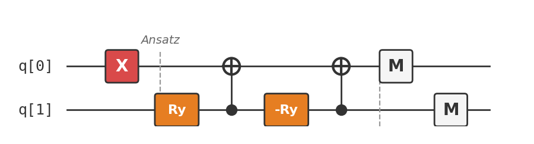

# Recipe 08: VQE for H₂

## What are we making?

A quantum algorithm that finds the **ground-state energy** of the hydrogen molecule — the simplest chemical system that's still genuinely quantum. The **Variational Quantum Eigensolver (VQE)**, proposed by Peruzzo et al. in 2014, uses a quantum computer to prepare trial wavefunctions and a classical computer to minimize the energy. When it converges, you've found the molecule's ground state.

This is quantum chemistry on a quantum computer. Two qubits, one molecule, and the same variational paradigm from Recipe 07 — but now the objective is the energy of nature itself.

## Ingredients

- 2 qubits
- X gate (`x`)
- RY gates (`ry`) — parameterised Y-rotations
- CNOT gates (`cx`)
- A [Quokka](https://www.quokkacomputing.com/) (puck or app)

**Prerequisites:** [Recipe 07 — QAOA](../07-qaoa-maxcut/README.md) for the variational paradigm. No chemistry background needed — we'll explain everything.

## Background: why quantum chemistry is hard

A hydrogen molecule (H₂) has two protons and two electrons. The electrons repel each other, attract the protons, and obey quantum mechanics. Finding the lowest-energy configuration means solving the **Schrödinger equation** for this system.

For H₂, classical computers can solve this exactly (it's small enough). But the computational cost of quantum chemistry scales **exponentially** with the number of electrons for classical methods. A molecule with 50 electrons is already intractable on any classical supercomputer.

Quantum computers offer a potential shortcut: since electrons are quantum objects, simulating them on a quantum computer is *natural*. The number of qubits grows **polynomially** with the system size, not exponentially.

VQE is the near-term approach: use a shallow quantum circuit (compatible with noisy hardware) and offload optimization to a classical computer.

## The H₂ Hamiltonian

After standard approximations (Born-Oppenheimer, STO-3G basis set, Bravyi-Kitaev transformation), the H₂ Hamiltonian reduces to a 2-qubit operator:

$$H = g_0 I + g_1 Z_0 + g_2 Z_1 + g_3 Z_0 Z_1 + g_4 X_0 X_1 + g_5 Y_0 Y_1$$

At bond length $R = 0.735$ Å (equilibrium), the coefficients are approximately:

| Term | Coefficient | Physical meaning |
|:---|:---|:---|
| $I$ | $-0.4804$ | Nuclear repulsion + constant |
| $Z_0$ | $+0.3435$ | One-electron energy (orbital 0) |
| $Z_1$ | $-0.4347$ | One-electron energy (orbital 1) |
| $Z_0 Z_1$ | $+0.5716$ | Electron-electron repulsion |
| $X_0 X_1$ | $+0.0910$ | Electron correlation |
| $Y_0 Y_1$ | $+0.0910$ | Electron correlation |

The ground-state energy is $E_0 \approx -1.137$ Hartree.

## Method

### Step 1: Prepare the Hartree-Fock state

The **Hartree-Fock (HF)** state is the best single-determinant (non-correlated) approximation. For H₂, it's $|01\rangle$ — one electron in the bonding orbital, none in the antibonding orbital:

```
x q[0];
```

This is our starting point. VQE will add correlations on top.

### Step 2: Apply the variational ansatz

We use a chemically-motivated ansatz: a parameterized single excitation that mixes the occupied and unoccupied orbitals:

```
ry(0.59) q[1];
cx q[1], q[0];
ry(-0.59) q[1];
cx q[1], q[0];
```

The parameter $\theta = 0.59$ has been pre-optimized. In a real VQE run, a classical optimizer would sweep over $\theta$ values, running the circuit each time, until it finds the $\theta$ that minimizes $\langle H \rangle$.

!!! info "What this ansatz does"
    It creates a superposition of $|01\rangle$ (both electrons in the bonding orbital) and $|10\rangle$ (both electrons in the antibonding orbital), with amplitudes controlled by $\theta$. This captures the **electron correlation** that Hartree-Fock misses.

### Step 3: Measure

```
measure q[0] -> c[0];
measure q[1] -> c[1];
```

Each measurement in the Z basis gives one sample. To estimate $\langle H \rangle$, you need measurements in **multiple bases**:

- **Z basis** (as shown): gives $\langle Z_0 \rangle$, $\langle Z_1 \rangle$, and $\langle Z_0 Z_1 \rangle$
- **X basis** (add H gates before measurement): gives $\langle X_0 X_1 \rangle$
- **Y basis** (add $S^\dagger$-H before measurement): gives $\langle Y_0 Y_1 \rangle$

Combine all terms: $\langle H \rangle = g_0 + g_1\langle Z_0\rangle + g_2\langle Z_1\rangle + g_3\langle Z_0 Z_1\rangle + g_4\langle X_0 X_1\rangle + g_5\langle Y_0 Y_1\rangle$.

## The complete circuit

Available as [`vqe_h2_zz.qasm`](vqe_h2_zz.qasm) (Z-basis measurement):

```
OPENQASM 2.0;
include "qelib1.inc";

qreg q[2];
creg c[2];

// Hartree-Fock state
x q[0];

// Variational ansatz (θ = 0.59)
ry(0.59) q[1];
cx q[1], q[0];
ry(-0.59) q[1];
cx q[1], q[0];

// Z-basis measurement
measure q[0] -> c[0];
measure q[1] -> c[1];
```



## Taste test

Run `vqe_h2_zz.qasm` on your Quokka. You should see mostly `01` with some `10`:

```
{'01': ~840, '10': ~184}
```

From these counts:
- $\langle Z_0 \rangle \approx (840 - 184)/1024 \approx +0.64$
- $\langle Z_1 \rangle \approx -0.64$
- $\langle Z_0 Z_1 \rangle \approx -1.0$ (01 and 10 both give $Z_0 Z_1 = -1$)

To get the full energy, you'd also run the X-basis and Y-basis variants and combine all terms. The result: $E \approx -1.137$ Hartree, within chemical accuracy of the exact value.

!!! tip "Sweeping the bond length"
    The real power of VQE is computing the **potential energy surface**: run VQE at different bond lengths $R$ to map out how the energy changes as you stretch the molecule. At large $R$, H₂ dissociates into two hydrogen atoms, and the electron correlation becomes critical. This is where classical methods like Hartree-Fock fail but VQE succeeds.

## Deep dive

??? abstract "The Bravyi-Kitaev transformation"

    The H₂ molecule has two electrons in two spin-orbitals. In second quantization, the Hamiltonian is:

    $$H = \sum_{pq} h_{pq} a_p^\dagger a_q + \frac{1}{2}\sum_{pqrs} h_{pqrs} a_p^\dagger a_q^\dagger a_r a_s$$

    where $a_p^\dagger$ and $a_p$ are fermionic creation and annihilation operators. These anticommute: $\{a_p, a_q^\dagger\} = \delta_{pq}$.

    To simulate fermions on qubits (which are bosonic — their operators commute), we need a mapping. The **Bravyi-Kitaev (BK)** transformation is one option (along with Jordan-Wigner):

    $$a_p^\dagger \to \text{(qubit operators)}$$

    For 2 qubits, the BK and Jordan-Wigner transformations give the same result. The Hamiltonian becomes the 2-qubit operator shown above, with coefficients determined by the molecular integrals $h_{pq}$ and $h_{pqrs}$.

    For larger molecules, the choice of transformation matters: Jordan-Wigner produces operators with $O(n)$ weight (long Pauli strings), while Bravyi-Kitaev reduces this to $O(\log n)$.

??? abstract "The variational principle: why VQE works"

    The **variational principle** states: for any trial state $|\psi(\theta)\rangle$,

    $$\langle\psi(\theta)|H|\psi(\theta)\rangle \geq E_0$$

    where $E_0$ is the true ground-state energy. Equality holds if and only if $|\psi(\theta)\rangle$ is the ground state.

    This means minimizing $\langle H \rangle$ over all $\theta$ gives an **upper bound** on $E_0$ that gets tighter as the ansatz gets more expressive. With the right ansatz and enough parameters, VQE converges to the exact ground state.

    **Why this is useful:** unlike phase estimation (Recipe 10), VQE doesn't require long coherent circuits. The circuit depth is fixed by the ansatz (here: just 4 gates). The convergence comes from the classical optimizer, not from deeper quantum circuits.

    **The tradeoff:** VQE needs many circuit evaluations (shots × optimizer iterations), and it's only as good as the ansatz. A bad ansatz can't reach the ground state no matter how well you optimize.

??? abstract "Chemical accuracy and the electron correlation problem"

    **Chemical accuracy** is the threshold below which quantum chemistry predictions match experiment: **1 kcal/mol ≈ 1.6 mHartree ≈ 43 meV**. Any method that achieves this is "good enough" for chemistry.

    **Hartree-Fock** treats electrons as independent particles moving in a mean field. It misses **electron correlation** — the fact that electrons actively avoid each other due to Coulomb repulsion and Pauli exclusion.

    For H₂:

    | Method | Energy (Hartree) | Error (mHa) |
    |:---|:---|:---|
    | Hartree-Fock | $-1.117$ | $20.3$ |
    | VQE ($\theta = 0.59$) | $-1.137$ | $0.3$ |
    | Exact (FCI) | $-1.1373$ | $0.0$ |

    VQE captures the correlation energy because its ansatz includes the $|10\rangle$ component (doubly-excited configuration), which Hartree-Fock cannot represent.

    For larger molecules, the correlation energy can be a significant fraction of the total energy, and capturing it accurately requires exponentially many classical resources — but only polynomially many qubits.

??? abstract "Measurement overhead: how many shots do you need?"

    Each Hamiltonian term requires separate measurements:

    - $Z_0$, $Z_1$, $Z_0 Z_1$: measured simultaneously in the Z basis
    - $X_0 X_1$: measured in the X basis (add H gates before measurement)
    - $Y_0 Y_1$: measured in the Y basis (add $S^\dagger H$ gates before measurement)

    So VQE for H₂ needs 3 circuit variants × $N_{\text{shots}}$ each.

    **How many shots?** The variance of the energy estimate scales as $\text{Var}(\hat{E}) \sim \sum_k g_k^2 / N_{\text{shots}}$. For chemical accuracy (error $< 1.6$ mHa), with H₂'s coefficients, you need roughly $N_{\text{shots}} \sim 10^4$ per basis.

    For larger molecules with more Hamiltonian terms, the measurement cost grows. Techniques like **classical shadows**, **grouping commuting terms**, and **derandomization** reduce this overhead.

## Chef's notes

- **VQE is QAOA's cousin.** Both are variational: a parameterized quantum circuit optimized by a classical loop. QAOA targets combinatorial problems; VQE targets quantum chemistry. The math is the same.

- **Two qubits for one molecule.** H₂ is the simplest nontrivial molecule, and it maps to just 2 qubits. Larger molecules need more: LiH needs 12 qubits (in minimal basis), water needs 14, and industrially relevant molecules need hundreds to thousands.

- **The ansatz choice is critical.** We used a chemically-motivated "UCCSD" (Unitary Coupled Cluster Singles and Doubles) ansatz. Other options: hardware-efficient ansätze (shallower but less physical), ADAPT-VQE (builds the ansatz adaptively), and symmetry-preserving ansätze.

- **If you liked this, try:** Recipe 09 (QFT) builds the Quantum Fourier Transform, which is the key subroutine for *exact* quantum chemistry via phase estimation (Recipe 10). Phase estimation gives the exact ground-state energy without optimization — but requires much deeper circuits.
