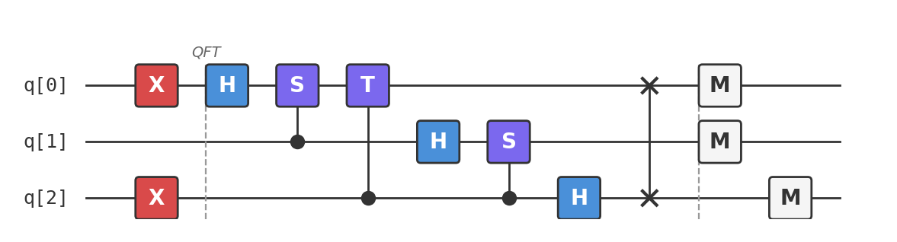

# Recipe 09: Quantum Fourier Transform

## What are we making?

The **Quantum Fourier Transform (QFT)** — the quantum analogue of the discrete Fourier transform, and the most important subroutine in quantum computing. It maps computational basis states to frequency-domain states, and it does so in $O(n^2)$ gates instead of the $O(n \cdot 2^n)$ operations needed classically.

The QFT is the engine behind **Shor's factoring algorithm**, **quantum phase estimation**, **quantum counting**, and a wide family of quantum algorithms. Understanding it is the gateway to the "second half" of quantum computing.

## Ingredients

- 3 qubits
- Hadamard gates (`h`)
- Controlled phase gates (`cp`)
- SWAP gate (`swap`)
- X gates (`x`) for input preparation
- A [Quokka](https://www.quokkacomputing.com/) (puck or app)

**Prerequisites:** [Recipe 03 — Deutsch-Jozsa](../03-deutsch-jozsa/README.md) for the Hadamard transform. The QFT generalizes it.

## Background: from Hadamard to Fourier

In Recipes 03–05, we used the Hadamard transform $H^{\otimes n}$ — the Fourier transform over $\mathbb{Z}_2^n$. It converts between the computational basis and the $|+\rangle/|{-}\rangle$ basis.

The QFT is the Fourier transform over $\mathbb{Z}_N$ (integers mod $N$, where $N = 2^n$). Instead of just $\pm 1$ signs, it uses **complex phases** $\omega^{jk}$ where $\omega = e^{2\pi i/N}$:

$$\text{QFT}|k\rangle = \frac{1}{\sqrt{N}} \sum_{j=0}^{N-1} \omega^{jk} |j\rangle = \frac{1}{\sqrt{N}} \sum_{j=0}^{N-1} e^{2\pi i jk/N} |j\rangle$$

For $N = 2$ ($n = 1$), this is just the Hadamard gate. For larger $N$, the phases become finer-grained, enabling precision that $H^{\otimes n}$ can't achieve.

## Method

### Step 1: Prepare an input state

We'll compute the QFT of $|5\rangle = |101\rangle$:

```
x q[0];
x q[2];
```

### Step 2: QFT circuit

The QFT decomposes into a sequence of Hadamards and controlled rotations, applied qubit by qubit from most-significant to least:

**Qubit 0 (most significant):**

```
h q[0];
cp(1.5708) q[1], q[0];   // controlled-R₂ = controlled-S (π/2 phase)
cp(0.7854) q[2], q[0];   // controlled-R₃ = controlled-T (π/4 phase)
```

The Hadamard creates a superposition. Each controlled phase gate adds increasingly fine phase rotations depending on the lower qubits.

**Qubit 1:**

```
h q[1];
cp(1.5708) q[2], q[1];   // controlled-R₂
```

**Qubit 2 (least significant):**

```
h q[2];
```

### Step 3: Swap to fix bit ordering

The QFT circuit naturally produces output in reversed bit order. A final SWAP corrects this:

```
swap q[0], q[2];
```

### Step 4: Measure

```
measure q[0] -> c[0];
measure q[1] -> c[1];
measure q[2] -> c[2];
```

!!! warning "The QFT output has equal amplitudes!"
    For any computational basis input $|k\rangle$, the QFT output has amplitude $1/\sqrt{N}$ on *every* basis state — so the measurement probabilities are all $1/N$. The information is in the **phases**, which aren't visible in Z-basis measurement. This is why the QFT is always used as a *subroutine* (inside QPE, Shor's, etc.) rather than a standalone algorithm.

## The QFT factored form

The key to the circuit: the QFT of $|k\rangle$ factors into a product of single-qubit states:

$$\text{QFT}|k\rangle = \frac{1}{\sqrt{2^n}} \bigotimes_{l=0}^{n-1} \left(|0\rangle + e^{2\pi i k / 2^{n-l}} |1\rangle\right)$$

Each qubit $l$ needs a phase that depends on the binary digits of $k$ below position $l$. The Hadamard creates the $|0\rangle + |1\rangle$ part; the controlled rotations add the right phases.

## The complete circuit

Available as [`qft.qasm`](qft.qasm):

```
OPENQASM 2.0;
include "qelib1.inc";

qreg q[3];
creg c[3];

// Input: |5⟩ = |101⟩
x q[0];
x q[2];

// QFT
h q[0];
cp(1.5708) q[1], q[0];
cp(0.7854) q[2], q[0];
h q[1];
cp(1.5708) q[2], q[1];
h q[2];

// Fix bit order
swap q[0], q[2];

measure q[0] -> c[0];
measure q[1] -> c[1];
measure q[2] -> c[2];
```



## Taste test

Paste `qft.qasm` into your Quokka. You should see all 8 states with roughly equal probability:

```
{'000': ~128, '001': ~128, '010': ~128, '011': ~128,
 '100': ~128, '101': ~128, '110': ~128, '111': ~128}
```

This confirms the QFT is working — every output state has probability $1/8$. The phases are there but invisible to a Z-basis measurement, which is exactly why the QFT is used inside larger algorithms (QPE, Shor's) that convert those phases back into measurable bit strings.

!!! tip "Try different inputs"
    Replace the input preparation:

    - `|0⟩ = |000⟩`: Remove both X gates → same uniform output (QFT of $|0\rangle$ is $|+\rangle^{\otimes n}$)
    - `|1⟩ = |001⟩`: Only `x q[2]` → still uniform amplitudes, different phases
    - All inputs give uniform measurement probabilities — the QFT preserves norms

## Deep dive

??? abstract "Gate count and comparison with classical FFT"

    **QFT gate count:** For $n$ qubits, the QFT requires:

    - $n$ Hadamard gates
    - $\frac{n(n-1)}{2}$ controlled rotation gates
    - $\lfloor n/2 \rfloor$ SWAP gates

    Total: $O(n^2)$ gates.

    **Classical FFT:** The Fast Fourier Transform on $N = 2^n$ points requires $O(N \log N) = O(n \cdot 2^n)$ operations.

    | $n$ | QFT gates | Classical FFT ops | Speedup |
    |:---|:---|:---|:---|
    | 3 | 9 | 24 | 2.7× |
    | 10 | 55 | 10,240 | 186× |
    | 20 | 210 | 20,971,520 | 99,864× |
    | 30 | 465 | $\sim 3 \times 10^{10}$ | $\sim 10^8$× |

    The QFT is **exponentially faster** than the classical FFT. However, there's a catch: you can't directly read out all $N$ Fourier coefficients (measurement collapses the state). The QFT is useful when you need just *one* piece of information from the Fourier transform — like a period (Shor) or a phase (QPE).

??? abstract "The controlled-$R_k$ gates"

    The QFT uses controlled rotations $R_k = \begin{pmatrix} 1 & 0 \\ 0 & e^{2\pi i/2^k} \end{pmatrix}$:

    | Gate | $k$ | Phase | OpenQASM |
    |:---|:---|:---|:---|
    | $R_1$ | 1 | $\pi$ | `cp(3.14159)` — this is CZ |
    | $R_2$ | 2 | $\pi/2$ | `cp(1.5708)` — this is CS (controlled-S) |
    | $R_3$ | 3 | $\pi/4$ | `cp(0.7854)` — this is CT (controlled-T) |
    | $R_k$ | $k$ | $2\pi/2^k$ | `cp(` $2\pi/2^k$ `)` |

    For large $n$, the gates $R_k$ with $k > \log(1/\epsilon)$ can be dropped without significantly affecting accuracy (approximate QFT). This reduces the gate count from $O(n^2)$ to $O(n \log n)$ while maintaining precision $\epsilon$.

??? abstract "Derivation of the factored form"

    We want to show that $\text{QFT}|k\rangle = \frac{1}{\sqrt{2^n}} \bigotimes_{l=0}^{n-1} (|0\rangle + e^{2\pi i k/2^{n-l}}|1\rangle)$.

    Write $k$ in binary: $k = k_0 2^{n-1} + k_1 2^{n-2} + \cdots + k_{n-1} 2^0$.

    The QFT definition gives:

    $$\text{QFT}|k\rangle = \frac{1}{\sqrt{2^n}} \sum_{j=0}^{2^n - 1} e^{2\pi i jk/2^n} |j\rangle$$

    Write $j$ in binary: $j = j_0 2^{n-1} + \cdots + j_{n-1}$. Then:

    $$e^{2\pi i jk/2^n} = \prod_{l=0}^{n-1} e^{2\pi i j_l 2^{n-1-l} k/2^n} = \prod_{l=0}^{n-1} e^{2\pi i j_l k/2^{l+1}}$$

    Since $j_l \in \{0,1\}$, each factor is either 1 (if $j_l = 0$) or $e^{2\pi i k/2^{l+1}}$ (if $j_l = 1$). The sum over $j$ factors into independent sums over each bit:

    $$\text{QFT}|k\rangle = \frac{1}{\sqrt{2^n}} \bigotimes_{l=0}^{n-1} \sum_{j_l=0}^{1} e^{2\pi i j_l k/2^{l+1}} |j_l\rangle = \frac{1}{\sqrt{2^n}} \bigotimes_{l=0}^{n-1} (|0\rangle + e^{2\pi i k/2^{l+1}}|1\rangle)$$

    ∎

    This factored form is what makes the circuit possible: each qubit can be prepared independently, using only the relevant bits of $k$.

??? abstract "QFT vs Hadamard transform: when to use which"

    | Feature | $H^{\otimes n}$ | QFT |
    |:---|:---|:---|
    | Group | $\mathbb{Z}_2^n$ | $\mathbb{Z}_{2^n}$ |
    | Phases | $\pm 1$ only | Full complex roots of unity |
    | Gate count | $n$ gates | $O(n^2)$ gates |
    | Used in | Deutsch-Jozsa, BV, Simon, Grover | Shor, QPE, quantum counting |
    | Finds | Hidden subgroups of $\mathbb{Z}_2^n$ | Periods in $\mathbb{Z}_N$ |

    Rule of thumb: if your problem has **binary** structure (XOR, parity, bitwise operations), use $H^{\otimes n}$. If it has **arithmetic** structure (addition, multiplication, modular exponentiation), use the QFT.

    Simon's algorithm is the border case: it finds a hidden period in $\mathbb{Z}_2^n$ using $H^{\otimes n}$. Shor's algorithm finds a hidden period in $\mathbb{Z}_N$ using the QFT. The transition from Simon to Shor is exactly the transition from Hadamard to QFT.

## Chef's notes

- **The QFT is a subroutine, not a standalone algorithm.** By itself, it transforms a known state into one with uniform measurement probabilities — not very useful. Its power comes when combined with phase estimation (Recipe 10) or modular exponentiation (Shor's).

- **Controlled phase vs. controlled rotation.** The `cp(θ)` gate in QASM is a controlled phase gate: it adds phase $e^{i\theta}$ to the $|11\rangle$ component only. This is equivalent to a controlled-$R_k$ gate up to global phase.

- **Approximate QFT.** For practical implementations, you can drop fine-grained rotations $R_k$ with $k > \log n$ and lose negligible accuracy. This is important for hardware with limited gate fidelity.

- **If you liked this, try:** Recipe 10 (Quantum Phase Estimation) uses the *inverse* QFT as its final step, extracting eigenvalue information from phase patterns. Together, QFT + QPE form the backbone of exact quantum algorithms.
