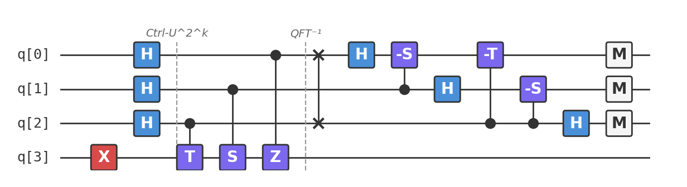

# Recipe 10: Quantum Phase Estimation

## What are we making?

An algorithm that measures the **eigenvalue** of a unitary operator to arbitrary precision. Given a unitary $U$ and an eigenstate $|u\rangle$ with $U|u\rangle = e^{2\pi i \varphi}|u\rangle$, Quantum Phase Estimation (QPE) determines $\varphi$ using a quantum circuit.

QPE is the **core subroutine** in Shor's factoring algorithm, quantum chemistry simulations, quantum counting, and many other algorithms. If the QFT (Recipe 09) is the engine, QPE is the car.

## Ingredients

- 4 qubits (3 counting + 1 eigenstate)
- Hadamard gates (`h`)
- Controlled phase gates (`cp`)
- SWAP gate (`swap`)
- X gate (`x`)
- A [Quokka](https://www.quokkacomputing.com/) (puck or app)

**Prerequisites:** [Recipe 09 — QFT](../09-quantum-fourier-transform/README.md). QPE uses the inverse QFT as its final step.

## Background: eigenvalues and why they matter

Every quantum gate $U$ has eigenvalues of the form $e^{2\pi i \varphi}$ (because $U$ is unitary, all eigenvalues have magnitude 1). The phase $\varphi \in [0, 1)$ encodes important information:

- **Shor's algorithm:** The eigenvalues of modular exponentiation encode the *period*, which gives the prime factors
- **Quantum chemistry:** The eigenvalues of the time-evolution operator encode *energy levels* of molecules
- **Quantum counting:** The eigenvalues of the Grover operator encode the *number of solutions*

Measuring $\varphi$ is thus a universal technique with wide applications.

### Our example: the T gate

We'll estimate the eigenvalue of the **T gate**:

$$T = \begin{pmatrix} 1 & 0 \\ 0 & e^{i\pi/4} \end{pmatrix}$$

$T|1\rangle = e^{i\pi/4}|1\rangle$, so $\varphi = 1/8$ (since $e^{i\pi/4} = e^{2\pi i \cdot 1/8}$).

With 3 counting qubits, we can resolve phases to precision $1/2^3 = 1/8$. Since $\varphi = 1/8$ is exactly representable, we'll get the exact answer deterministically.

## Method

### Step 1: Prepare the eigenstate

```
x q[3];
```

Put the target qubit in $|1\rangle$, which is an eigenstate of $T$.

### Step 2: Create superposition in the counting register

```
h q[0];
h q[1];
h q[2];
```

The counting register is now $\frac{1}{\sqrt{8}}\sum_{k=0}^{7}|k\rangle$.

### Step 3: Controlled-$U^{2^k}$ operations

This is the heart of QPE. Each counting qubit $q[k]$ controls $U^{2^k}$ on the eigenstate:

```
// Controlled-T^1 from q[2] (least significant bit)
cp(0.7854) q[2], q[3];

// Controlled-T^2 = controlled-S from q[1]
cp(1.5708) q[1], q[3];

// Controlled-T^4 = controlled-Z from q[0] (most significant bit)
cp(3.14159) q[0], q[3];
```

After this step, the counting register is in state:

$$\frac{1}{\sqrt{8}} \sum_{k=0}^{7} e^{2\pi i \varphi k} |k\rangle$$

This is exactly the QFT of $|\varphi \cdot 2^n\rangle = |1\rangle$ (in this case). The inverse QFT will undo this, producing $|1\rangle$ in the counting register.

!!! info "Why controlled-$U^{2^k}$?"
    When $U|u\rangle = e^{2\pi i\varphi}|u\rangle$, a controlled-$U^{2^k}$ on $|+\rangle|u\rangle$ produces $\frac{1}{\sqrt{2}}(|0\rangle + e^{2\pi i \varphi 2^k}|1\rangle)|u\rangle$. Each counting qubit picks up a phase proportional to a different power of 2 — this is how the binary digits of $\varphi$ get encoded.

### Step 4: Inverse QFT

```
swap q[0], q[2];       // Fix bit ordering
h q[0];
cp(-1.5708) q[1], q[0];
h q[1];
cp(-0.7854) q[2], q[0];
cp(-1.5708) q[2], q[1];
h q[2];
```

The inverse QFT converts the phase-encoded state back to a computational basis state. Since the phases encode $\varphi = 1/8 = 0.001_2$ (in binary), the counting register collapses to $|001\rangle = |1\rangle$.

### Step 5: Measure

```
measure q[0] -> c[0];
measure q[1] -> c[1];
measure q[2] -> c[2];
```

Read the counting register: $001$ (binary) = $1$ (decimal). Phase estimate: $\hat{\varphi} = 1/2^3 = 1/8$.

Eigenvalue: $e^{2\pi i/8} = e^{i\pi/4}$. This matches $T|1\rangle = e^{i\pi/4}|1\rangle$ exactly. ✓

## The complete circuit

Available as [`qpe.qasm`](qpe.qasm):

```
OPENQASM 2.0;
include "qelib1.inc";

qreg q[4];
creg c[3];

x q[3];

h q[0];
h q[1];
h q[2];

// Controlled-U^(2^k)
cp(0.7854) q[2], q[3];
cp(1.5708) q[1], q[3];
cp(3.14159) q[0], q[3];

// Inverse QFT
swap q[0], q[2];
h q[0];
cp(-1.5708) q[1], q[0];
h q[1];
cp(-0.7854) q[2], q[0];
cp(-1.5708) q[2], q[1];
h q[2];

measure q[0] -> c[0];
measure q[1] -> c[1];
measure q[2] -> c[2];
```



## Taste test

Paste `qpe.qasm` into your Quokka. You should see:

```
{'001': 1024}
```

The result is deterministic: $001$ (binary) → $\varphi = 1/8$. The T gate's eigenvalue is $e^{2\pi i/8} = e^{i\pi/4}$. ✓

!!! tip "Try different unitaries"
    - **S gate** ($\varphi = 1/4$): Replace the controlled phase angles with controlled-$S^{2^k}$ — expect output $|010\rangle = 2$ → $\varphi = 2/8 = 1/4$
    - **Z gate** ($\varphi = 1/2$): Expect $|100\rangle = 4$ → $\varphi = 4/8 = 1/2$
    - **Non-exact phases** (e.g., $\varphi = 1/3$): The output distributes across nearby values, peaking at the best $n$-bit approximation

## Deep dive

??? abstract "QPE for non-exact phases"

    When $\varphi$ is not an exact multiple of $1/2^n$, the inverse QFT doesn't perfectly concentrate on a single state. Instead, the probability distributes across nearby values.

    Let $b = \lfloor 2^n \varphi \rceil$ be the nearest integer to $2^n \varphi$, and let $\delta = 2^n \varphi - b$ be the fractional error ($|\delta| \leq 1/2$).

    The probability of measuring $b$ is:

    $$\Pr(b) = \frac{1}{2^{2n}} \left|\frac{1 - e^{2\pi i \delta}}{1 - e^{2\pi i \delta/2^n}}\right|^2 \geq \frac{4}{\pi^2} \approx 0.405$$

    So even in the worst case, you get the best $n$-bit approximation with probability $> 40\%$. Running a few times and taking the majority vote gives high confidence.

    For higher precision: add more counting qubits ($m$ extra qubits give $2^m$ amplification of the success probability) or use the robust version with $n + O(\log(1/\epsilon))$ qubits for success probability $\geq 1 - \epsilon$.

??? abstract "QPE + Hamiltonian simulation = quantum chemistry"

    To find the ground-state energy $E_0$ of a Hamiltonian $H$:

    1. Implement $U = e^{-iHt}$ (Hamiltonian simulation)
    2. Prepare an approximate ground state $|\psi_0\rangle$ (e.g., from VQE)
    3. Run QPE with $U$ and $|\psi_0\rangle$
    4. The measured phase $\varphi$ gives $E_0 = 2\pi\varphi/t$

    This is the "exact" approach to quantum chemistry, in contrast to VQE's variational approach (Recipe 08). QPE gives the exact energy to $n$-bit precision, but requires:

    - $O(1/\epsilon)$ controlled-$U$ operations for precision $\epsilon$
    - Coherent circuits of depth $O(1/\epsilon)$ — much deeper than VQE
    - A reasonable initial state (overlap $|\langle\psi_0|E_0\rangle|^2 > 0$ determines success probability)

    For near-term hardware: VQE. For fault-tolerant hardware: QPE.

??? abstract "Connection to Shor's algorithm"

    Shor's factoring algorithm is QPE applied to **modular exponentiation**.

    To factor $N$:

    1. Pick a random $a < N$
    2. Define $U|x\rangle = |ax \bmod N\rangle$ (modular multiplication)
    3. Run QPE on $U$ to find the eigenvalue $e^{2\pi i s/r}$, where $r$ is the **order** of $a$ mod $N$
    4. Use continued fractions to extract $r$ from $s/r$
    5. With high probability, $\gcd(a^{r/2} \pm 1, N)$ gives a non-trivial factor

    The QFT provides the precision to resolve $s/r$; the controlled-$U^{2^k}$ operations do the repeated squaring; and the classical post-processing finds the factors.

    Total qubits: $O(\log N)$ for the counting register + $O(\log N)$ for the modular arithmetic. Total gates: $O(\log^3 N)$ with schoolbook multiplication.

??? abstract "The eigenstate preparation problem"

    QPE assumes you start with an eigenstate $|u\rangle$. In practice, you rarely know the eigenstate in advance — that's what you're trying to find!

    **Solutions:**

    1. **Approximate eigenstate:** If $|\psi\rangle = \sum_j \alpha_j |u_j\rangle$, QPE returns eigenvalue $\varphi_j$ with probability $|\alpha_j|^2$. So any state with reasonable overlap with the ground state works.

    2. **VQE + QPE pipeline:** Use VQE (Recipe 08) to find an approximate ground state, then use QPE to refine the energy to high precision.

    3. **Adiabatic state preparation:** Slowly evolve from a known ground state of a simple Hamiltonian to the target Hamiltonian.

    For our recipe, we cheat: we know $|1\rangle$ is an eigenstate of $T$. For real applications, eigenstate preparation is often the hardest part.

## Chef's notes

- **QPE is the gold standard for eigenvalue problems.** Its precision is limited only by the number of counting qubits and circuit depth — not by heuristics or optimization landscapes.

- **It requires deep circuits.** The controlled-$U^{2^k}$ operations need coherent evolution for exponentially many steps. This is why QPE is a "fault-tolerant era" algorithm — you need error correction to run it on large problems.

- **The T gate example is a toy.** In real applications, $U$ would be a Hamiltonian simulation operator ($e^{-iHt}$) or a modular exponentiation circuit ($a^x \bmod N$). These are much more complex, but the QPE wrapper stays the same.

- **If you liked this, try:** Recipe 11 (Error Mitigation) addresses the noise problem that makes QPE hard on current hardware. Recipe 12 (Quantum Counting) applies QPE to the Grover operator to count solutions.
