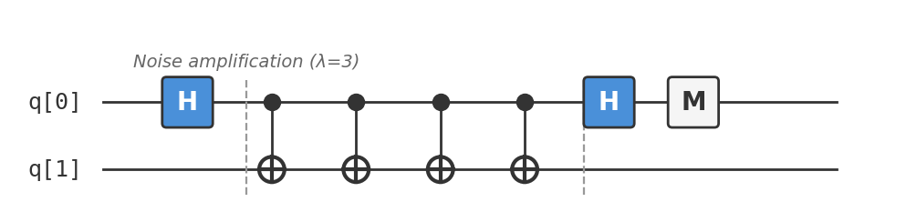

# Recipe 11: Error Mitigation (ZNE)

## What are we making?

A technique to **reduce the effect of hardware noise** on quantum circuit results — without any additional qubits. **Zero-Noise Extrapolation (ZNE)** is the simplest and most widely-used error mitigation method: run the same circuit at multiple noise levels, then extrapolate backward to estimate what the result would be at zero noise.

This isn't error *correction* (which requires massive overhead). It's error *mitigation* — a practical trick for making noisy results more useful right now.

## Ingredients

- 1–2 qubits
- Hadamard gates (`h`)
- CNOT gates (`cx`) — for noise amplification
- A [Quokka](https://www.quokkacomputing.com/) (puck or app)
- Basic arithmetic (for the extrapolation)

**Prerequisites:** Any earlier recipe. This technique applies to any quantum circuit.

## Background: the noise problem

Real quantum hardware is noisy. Every gate has a small probability of error — a bit flip, a phase flip, or a more complex decoherency. After a circuit with $d$ gates, each with error rate $\epsilon$, the output is corrupted by roughly $d\epsilon$ total error.

For a 100-gate circuit with 1% error per gate, you've lost about 63% of your signal ($e^{-100 \times 0.01} \approx 0.37$). The result is a washed-out mixture of the correct answer and random noise.

**Error correction** fixes this by encoding qubits redundantly, but current hardware doesn't have enough qubits for practical error correction.

**Error mitigation** doesn't fix errors — it *models* them and extrapolates to what the answer would be without errors. No extra qubits needed.

## How ZNE works

The key insight: if you can make the noise **worse** in a controlled way, you can measure the noise trend and extrapolate backward to zero noise.

**Step 1:** Run the circuit at the base noise level ($\lambda = 1$). Record the expectation value $E_1$.

**Step 2:** Run the circuit at amplified noise ($\lambda = 3, 5, \ldots$) by inserting identity gates that add noise without changing the logic. Record $E_3, E_5, \ldots$

**Step 3:** Fit a model $E(\lambda)$ and extrapolate to $\lambda = 0$.

The simplest option: linear extrapolation with two points. Better: Richardson extrapolation with three or more points.

## Method

We'll demonstrate ZNE on the simplest possible circuit: prepare $|+\rangle$ and measure $\langle X \rangle$. The ideal answer is $\langle X \rangle = 1.0$.

### Scale 1: Base circuit

```
h q[0];        // prepare |+⟩
// (identity — no extra gates)
h q[0];        // rotate to Z basis
measure q[0] -> c[0];
```

On a perfect simulator: always $|0\rangle$, so $\langle X \rangle = 1.0$.
On noisy hardware: mostly $|0\rangle$ with some $|1\rangle$, so $\langle X \rangle < 1.0$.

### Scale 3: Noise-amplified circuit

Insert two CNOT pairs (each pair is logically identity but adds gate noise):

```
h q[0];
cx q[0], q[1]; cx q[0], q[1];   // pair 1: CX·CX = I
cx q[0], q[1]; cx q[0], q[1];   // pair 2: CX·CX = I
h q[0];
measure q[0] -> c[0];
```

Logically identical to Scale 1, but with 4 extra CNOTs worth of noise. The noise is approximately 3× the original (1 base + 4 identity gates ≈ 3× noise).

### Scale 5: More noise

Insert four CNOT pairs (8 extra CNOTs):

```
h q[0];
cx q[0], q[1]; cx q[0], q[1];   // pair 1
cx q[0], q[1]; cx q[0], q[1];   // pair 2
cx q[0], q[1]; cx q[0], q[1];   // pair 3
cx q[0], q[1]; cx q[0], q[1];   // pair 4
h q[0];
measure q[0] -> c[0];
```

Approximately 5× noise.

### Extrapolation

With three data points $(\lambda_1, E_1), (\lambda_3, E_3), (\lambda_5, E_5)$, extrapolate to $\lambda = 0$:

**Linear (2 points):**

$$E_0 \approx E_1 - \frac{E_3 - E_1}{3 - 1} \times 1 = \frac{3E_1 - E_3}{2}$$

**Richardson (3 points):**

$$E_0 \approx \frac{15E_1 - 10E_3 + 3E_5}{8}$$

## The complete circuits

Three QASM files, one per noise scale:

- [`zne_scale1.qasm`](zne_scale1.qasm) — base circuit ($\lambda = 1$)
- [`zne_scale3.qasm`](zne_scale3.qasm) — 3× noise ($\lambda = 3$)
- [`zne_scale5.qasm`](zne_scale5.qasm) — 5× noise ($\lambda = 5$)



## Taste test

Run all three circuits on your Quokka. On a **perfect simulator**, all three give $|0\rangle$ every time ($\langle X \rangle = 1.0$). The technique only shows its value on **noisy hardware**.

**Example noisy results** (1% depolarizing error per CNOT):

| Scale $\lambda$ | Counts | $\langle X \rangle$ |
|:---|:---|:---|
| 1 | $\{0: 966, 1: 58\}$ | $0.89$ |
| 3 | $\{0: 921, 1: 103\}$ | $0.80$ |
| 5 | $\{0: 871, 1: 153\}$ | $0.70$ |

**Linear extrapolation** ($\lambda = 1, 3$): $E_0 \approx \frac{3 \times 0.89 - 0.80}{2} = 0.94$

**Richardson extrapolation** ($\lambda = 1, 3, 5$): $E_0 \approx \frac{15 \times 0.89 - 10 \times 0.80 + 3 \times 0.70}{8} = 0.93$

Both are closer to the ideal ($1.0$) than the raw $0.89$. Not perfect — but you got a better answer without any hardware improvements.

!!! tip "Apply this to any recipe"
    ZNE works on any circuit. To mitigate Recipe 01 (Bell State), for example, replace the CNOT with three CNOTs (CX·CX·CX = CX) for $\lambda = 3$, and five for $\lambda = 5$. Then extrapolate the correlation measurement.

## Deep dive

??? abstract "The noise model: depolarizing channels"

    ZNE assumes noise increases smoothly with the number of gates. The simplest model: each gate applies a **depolarizing channel** with probability $p$:

    $$\mathcal{E}(\rho) = (1 - p)\rho + \frac{p}{d}I$$

    where $d$ is the Hilbert space dimension. This replaces the state with the maximally mixed state with probability $p$.

    After $n$ gates, the expectation value decays as:

    $$E_n = (1 - p)^n E_{\text{ideal}}$$

    This is an exponential decay in $n$. If noise scaling increases $n$ by factor $\lambda$:

    $$E(\lambda) = (1 - p)^{\lambda n} E_{\text{ideal}} = e^{-\lambda n \ln(1/(1-p))} E_{\text{ideal}}$$

    Extrapolating $E(\lambda)$ to $\lambda = 0$ gives $E_{\text{ideal}}$ exactly if the exponential model is correct. In practice, the model is approximate, so the extrapolation improves but doesn't perfect the result.

??? abstract "Richardson extrapolation: the math"

    Given $m$ data points at noise scales $\lambda_1 < \lambda_2 < \cdots < \lambda_m$, **Richardson extrapolation** fits a polynomial of degree $m - 1$ through the points and evaluates at $\lambda = 0$.

    The zero-noise estimate is:

    $$E_0 = \sum_{k=1}^{m} \gamma_k E(\lambda_k)$$

    where the coefficients $\gamma_k$ satisfy:

    $$\sum_{k=1}^{m} \gamma_k = 1 \quad \text{and} \quad \sum_{k=1}^{m} \gamma_k \lambda_k^j = 0 \quad \text{for } j = 1, \ldots, m-1$$

    **For 2 points** ($\lambda = 1, 3$): $\gamma_1 = 3/2$, $\gamma_2 = -1/2$:

    $$E_0 = \frac{3E_1 - E_3}{2}$$

    **For 3 points** ($\lambda = 1, 3, 5$): $\gamma_1 = 15/8$, $\gamma_2 = -10/8$, $\gamma_3 = 3/8$:

    $$E_0 = \frac{15E_1 - 10E_3 + 3E_5}{8}$$

    Higher-order extrapolation cancels higher-order noise terms but amplifies statistical fluctuations. In practice, 2–3 points is optimal for most hardware noise levels.

??? abstract "Other error mitigation techniques"

    ZNE is just one technique. The error mitigation zoo includes:

    | Technique | Idea | Overhead | Limitations |
    |:---|:---|:---|:---|
    | **ZNE** | Extrapolate to zero noise | 2–5× circuit runs | Assumes smooth noise scaling |
    | **Probabilistic error cancellation (PEC)** | Quasi-probability decomposition of ideal gates | Exponential in circuit depth ($\gamma^{2d}$ samples) | Requires noise characterization |
    | **Clifford data regression (CDR)** | Learn error model from near-Clifford circuits | Moderate | Assumes simple noise |
    | **Symmetry verification** | Post-select on known symmetries | Discards some shots | Needs problem-specific symmetries |
    | **Twirling** | Convert coherent errors to stochastic | Negligible | Doesn't reduce stochastic noise |
    | **Classical shadows** | Efficient observable estimation | Many circuits | Statistical technique, not mitigation |

    PEC is the gold standard — it gives an unbiased estimate of the noiseless result — but the sample overhead grows exponentially with circuit depth. ZNE offers a practical middle ground: moderate improvement with modest overhead.

??? abstract "When does ZNE fail?"

    ZNE works well when:

    - Noise scales linearly with the number of gates
    - The noise is roughly gate-independent (each gate adds similar noise)
    - The circuit is short enough that the signal hasn't completely decayed

    ZNE breaks down when:

    - **Non-Markovian noise:** Noise that depends on the history of operations (crosstalk, drift)
    - **Measurement errors:** ZNE as described only mitigates gate noise. Measurement errors need separate calibration
    - **Signal near zero:** If the noisy expectation is already close to 0 (fully depolarized), extrapolation amplifies noise more than signal
    - **Very deep circuits:** The exponential decay means there's simply no signal left to extrapolate

    For practical VQE-style circuits (tens to low hundreds of gates), ZNE typically improves results by 10–50%.

## Chef's notes

- **This is the most practical recipe in the cookbook.** Every other recipe assumes perfect execution. This one deals with reality. If you're running on real hardware, ZNE is your first line of defense.

- **The circuits are intentionally simple.** We use a 1-qubit circuit to illustrate the concept clearly. On a real problem, you'd apply ZNE to your actual algorithm circuit (Grover, VQE, QAOA) by inserting identity-gate pairs around the critical gates.

- **On a simulator, all three circuits give the same result.** ZNE is invisible on a perfect simulator. You need actual hardware noise (or a noise model) to see the benefit.

- **If you liked this, try:** Recipe 12 (Quantum Counting) is the final recipe. It combines Grover's search (Recipe 06) with QPE (Recipe 10) — two powerful algorithms working together.
