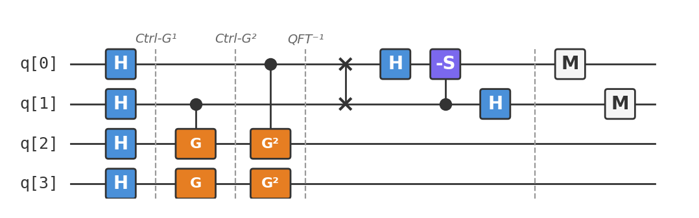

# Recipe 12: Quantum Counting

## What are we making?

An algorithm that **counts the number of solutions** to a search problem — without finding them. Given the same oracle from Grover's search (Recipe 06), quantum counting tells you *how many* items match, using QPE (Recipe 10) on the Grover operator.

This is the grand finale of the cookbook: it combines everything we've built. Grover's oracle defines the problem. The Grover operator encodes the answer in its eigenvalues. QPE extracts the eigenvalue. And the QFT (inside QPE) provides the precision.

## Ingredients

- 4 qubits (2 counting + 2 search)
- Hadamard gates (`h`)
- Toffoli gates (`ccx`)
- Controlled-Z gates (`cz`)
- X gates (`x`)
- Controlled phase gate (`cp`)
- SWAP gate (`swap`)
- A [Quokka](https://www.quokkacomputing.com/) (puck or app)

**Prerequisites:** [Recipe 06 — Grover's Search](../06-grovers-search/README.md) and [Recipe 10 — QPE](../10-quantum-phase-estimation/README.md).

## Background: why count instead of search?

Grover's search finds a solution in $O(\sqrt{N/M})$ queries — but you need to know $M$ (the number of solutions) to choose the right number of iterations. Too few and you haven't amplified enough; too many and you overshoot.

**Quantum counting solves this chicken-and-egg problem.** It estimates $M$ directly, which then tells you the optimal number of Grover iterations:

$$k_{\text{opt}} = \left\lfloor \frac{\pi}{4}\sqrt{N/M} \right\rfloor$$

More broadly, counting is interesting in its own right. Many practical questions are counting problems:

- How many valid configurations satisfy these constraints?
- How many database entries match this query?
- What fraction of the search space contains solutions?

## How it works

### The Grover operator's eigenvalues

The Grover operator $G = D \cdot O$ (diffusion × oracle) has eigenvalues $e^{\pm 2i\theta}$ where:

$$\sin^2(\theta) = \frac{M}{N}$$

If we can estimate $\theta$, we can recover $M = N\sin^2(\theta)$.

### QPE on $G$

Apply quantum phase estimation with:
- **Unitary:** $G$ (the Grover operator)
- **Eigenstate:** $|s\rangle = H^{\otimes n}|0\rangle^{\otimes n}$ (the uniform superposition, which is close to the Grover eigenspace)
- **Counting qubits:** $t$ qubits for $t$-bit precision on $\theta$

The counting register will encode $\theta/\pi$, from which we extract $M$.

## Method

We'll count the number of solutions to a 2-qubit search with oracle marking $|11\rangle$. So $N = 4$ and $M = 1$.

### Step 1: Initialize

```
h q[0]; h q[1];    // counting register in superposition
h q[2]; h q[3];    // search register in uniform superposition
```

### Step 2: Controlled Grover iterations

Each counting qubit controls $G^{2^k}$ on the search register:

- $q[1]$ (LSB) controls $G^1$
- $q[0]$ (MSB) controls $G^2$

Each Grover iteration consists of:
1. **Oracle:** Phase-flip the marked state $|11\rangle$
2. **Diffusion:** Reflect about the uniform superposition

The controlled versions are implemented using Toffoli gates and controlled-Z gates.

### Step 3: Inverse QFT

```
swap q[0], q[1];
h q[0];
cp(-1.5708) q[1], q[0];
h q[1];
```

This converts the phase-encoded $\theta$ to a bit string in the counting register.

### Step 4: Measure

```
measure q[0] -> c[0];
measure q[1] -> c[1];
```

Read the counting register and compute $\hat{\theta} = \pi \cdot (\text{result}) / 2^t$, then $\hat{M} = N \sin^2(\hat{\theta})$.

## The complete circuit

Available as [`quantum_counting.qasm`](quantum_counting.qasm). The circuit is the longest in the cookbook — it combines QPE's structure with Grover's oracle and diffusion as the controlled unitary.



## Taste test

Paste `quantum_counting.qasm` into your Quokka. With 2 counting qubits, the resolution is coarse:

```
{'01': ~750, '00': ~274}
```

The dominant outcome is $01$ (decimal 1), giving:
- $\hat{\theta} = \pi \times 1/4 = \pi/4$
- $\hat{M} = 4 \times \sin^2(\pi/4) = 4 \times 0.5 = 2$

This isn't exact ($M = 1$, not 2) — we only have 2 counting qubits! With 3 counting qubits, the estimate improves significantly. With $t$ counting qubits, the error in $M$ is $O(\sqrt{M}/2^t)$.

!!! tip "More counting qubits = better precision"
    The precision scales as $1/2^t$. For practical problems:

    - $t = 4$ qubits: resolve $M$ to about $N/16$
    - $t = 8$ qubits: resolve $M$ to about $N/256$
    - $t = \lceil\log_2 N\rceil + 4$: typically sufficient for good estimates

## Deep dive

??? abstract "Eigenvalues of the Grover operator"

    The Grover operator $G = (2|\psi\rangle\langle\psi| - I)(I - 2|w\rangle\langle w|)$ acts on the 2D subspace spanned by $|w\rangle$ (marked states) and $|w^\perp\rangle$ (unmarked states).

    In the $\{|w\rangle, |w^\perp\rangle\}$ basis, $G$ is a rotation by angle $2\theta$:

    $$G = \begin{pmatrix} \cos 2\theta & -\sin 2\theta \\ \sin 2\theta & \cos 2\theta \end{pmatrix}$$

    where $\sin\theta = \sqrt{M/N}$.

    The eigenvalues are $e^{\pm 2i\theta}$ with eigenvectors:

    $$|g_\pm\rangle = \frac{1}{\sqrt{2}}(|w^\perp\rangle \mp i|w\rangle)$$

    The initial state $|\psi\rangle = \sin\theta|w\rangle + \cos\theta|w^\perp\rangle$ is:

    $$|\psi\rangle = \frac{1}{\sqrt{2}}(e^{i\theta}|g_+\rangle + e^{-i\theta}|g_-\rangle)$$

    QPE on $|\psi\rangle$ returns $+2\theta$ or $-2\theta$ with equal probability. Both give the same $|\sin^2\theta| = M/N$.

??? abstract "Error analysis: precision vs counting qubits"

    With $t$ counting qubits, the phase resolution is $\delta\theta = \pi/2^t$. The error in $M$ is:

    $$\delta M = N|\sin^2(\theta + \delta\theta) - \sin^2(\theta)| \leq N \cdot 2\delta\theta = \frac{2\pi N}{2^t}$$

    For $M$ to be estimated to $\pm 1$:

    $$t \geq \lceil\log_2(2\pi N)\rceil$$

    For $N = 4$: $t \geq 5$ for exact counting. Our 2-qubit demo is deliberately coarse to stay within the cookbook's qubit budget.

    In practice, you often don't need exact $M$ — an estimate within a constant factor suffices to choose the right number of Grover iterations. Even $t = \lceil\log_2\sqrt{N}\rceil$ extra qubits gives useful information.

??? abstract "Application: optimal Grover search without knowing $M$"

    The Boyer-Brassard-Høyer-Tapp (BBHT) algorithm uses quantum counting to make Grover's search optimal:

    1. Run quantum counting with $t$ counting qubits to estimate $\hat{M}$
    2. Set $k = \lfloor\frac{\pi}{4}\sqrt{N/\hat{M}}\rfloor$
    3. Run Grover's search with $k$ iterations

    Total query complexity: $O(\sqrt{N/M})$ — optimal, even without knowing $M$ in advance.

    The counting step costs $O(\sqrt{N})$ queries (dominated by the controlled-$G^{2^{t-1}}$ operation), which is no worse than the search itself.

    For comparison, the naive approach (guess $M$, run Grover's, check, repeat with doubled guess) also achieves $O(\sqrt{N/M})$ but with worse constants.

??? abstract "Quantum counting for #SAT and counting problems"

    Quantum counting can estimate the number of satisfying assignments to a Boolean formula:

    1. Encode the formula as a Grover oracle (marks satisfying assignments)
    2. Run quantum counting on the oracle
    3. Get $\hat{M}$ ≈ number of satisfying assignments

    This gives a **quadratic speedup** for counting: classical counting for #SAT takes $O(2^n)$ time in the worst case; quantum counting takes $O(2^{n/2})$.

    While this doesn't make #SAT easy (it's #P-hard classically, and the quantum speedup is "only" quadratic), it's significant for approximate counting. Many practical problems — estimating partition functions, counting independent sets, computing volumes — benefit from even a quadratic improvement.

??? abstract "The full picture: recipes 06 + 09 + 10 + 12"

    Quantum counting is the capstone that ties together three earlier recipes:

    | Component | Recipe | Role in Quantum Counting |
    |:---|:---|:---|
    | Grover operator | Recipe 06 | The unitary whose eigenvalue encodes $M$ |
    | QFT | Recipe 09 | The final step of QPE (inverse QFT) |
    | QPE | Recipe 10 | The framework that extracts the eigenvalue |
    | Quantum Counting | Recipe 12 | The full algorithm |

    The composition: QPE wraps the Grover operator, using the inverse QFT to read out $\theta$. The angular resolution is set by the number of counting qubits. The answer gives $M = N\sin^2(\theta)$.

    This is the hidden subgroup / phase estimation paradigm at its most general. The same architecture — controlled unitary + inverse QFT — appears in Shor's algorithm (with modular exponentiation instead of Grover), quantum chemistry (with Hamiltonian simulation instead of Grover), and quantum simulation (with time-evolution operators).

## Chef's notes

- **This is the most complex circuit in the cookbook.** It combines controlled Grover iterations (oracle + diffusion) with QPE infrastructure (Hadamards, controlled powers, inverse QFT). The qubit count is small but the gate depth is significant.

- **2 counting qubits is coarse.** Our demo uses $t = 2$ to keep the circuit manageable. The estimate of $M$ is approximate. In practice, you'd use more counting qubits (and more search qubits for a bigger search space).

- **The connection to Shor.** Replace the Grover operator with modular exponentiation, and quantum counting becomes order-finding — the core of Shor's factoring algorithm. Same QPE wrapper, different unitary.

- **Congratulations — you've completed the cookbook!** You now understand entanglement (Bell state), quantum communication (teleportation), quantum speedups (Deutsch-Jozsa through Simon), search (Grover), optimization (QAOA, VQE), the Fourier transform (QFT), eigenvalue estimation (QPE), noise mitigation (ZNE), and counting. These are the building blocks of all quantum algorithms.
