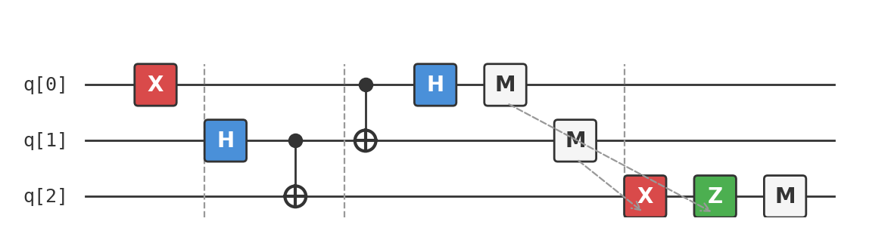

# Recipe 02: Quantum Teleportation

## What are we making?

A protocol that transmits an unknown quantum state from one qubit to another — without physically moving the qubit. Alice has a qubit in some state she wants to send to Bob. Using a shared Bell pair and two classical bits of communication, Bob ends up with a perfect copy of Alice's original state. The original is destroyed in the process (as it must be — quantum mechanics forbids copying).

This is **quantum teleportation**, arguably the most beautiful protocol in quantum information. It was proposed by Bennett, Brassard, Crépeau, Jozsa, Peres, and Wootman in 1993, and it's the foundation of quantum networks, quantum error correction, and measurement-based quantum computing.

## Ingredients

- 3 qubits
- 1 X gate (`x`)
- 2 Hadamard gates (`h`)
- 2 CNOT gates (`cx`)
- 1 conditional-X gate
- 1 conditional-Z gate
- A [Quokka](https://www.quokkacomputing.com/) (puck or app)

**Prerequisites:** [Recipe 01 — Bell State](../01-bell-state/README.md). You should understand entanglement and the Bell state $|\Phi^+\rangle$ before continuing.

## Background: why can't you just copy a qubit?

In classical computing, copying is free. You can duplicate a file, clone a variable, broadcast a message. But the **no-cloning theorem** says you cannot copy an arbitrary unknown quantum state. There is no quantum operation that takes $|\psi\rangle$ and produces $|\psi\rangle \otimes |\psi\rangle$.

This sounds like a limitation, but it's actually what makes quantum cryptography secure — and it's what makes teleportation non-trivial. If you could copy qubits, teleportation would be boring. Because you can't, moving quantum information requires a clever workaround: consume an entangled pair and send two classical bits.

## The setup

Three qubits, two players:

| Qubit | Owner | Role |
|-------|-------|------|
| `q[0]` | Alice | The state she wants to teleport |
| `q[1]` | Alice | Her half of the shared Bell pair |
| `q[2]` | Bob | His half of the shared Bell pair |

Alice wants to send the state of `q[0]` to Bob, who is far away. She can send classical bits (phone, email, carrier pigeon) but cannot physically ship a qubit.

## Method

### Step 1: Prepare the state to teleport

For this recipe, we'll teleport the state $|1\rangle$. We prepare it by flipping qubit 0:

```
x q[0];
```

In a real application, `q[0]` could be in any state $\alpha|0\rangle + \beta|1\rangle$ — the protocol works regardless. We use $|1\rangle$ because it's easy to verify: after teleportation, Bob's qubit must always measure 1.

!!! note "Why not teleport a superposition?"
    We could prepare $|+\rangle$ (apply H instead of X), but then the output is statistical — harder to confirm it worked in a single run. Teleporting $|1\rangle$ gives a deterministic check: if Bob ever measures 0, something broke.

### Step 2: Create the shared Bell pair

Alice and Bob share a Bell pair — the same one from [Recipe 01](../01-bell-state/README.md):

```
h q[1];
cx q[1], q[2];
```

This creates the state $|\Phi^+\rangle = \frac{1}{\sqrt{2}}(|00\rangle + |11\rangle)$ between `q[1]` and `q[2]`.

The full three-qubit state is now:

$$|1\rangle \otimes \frac{1}{\sqrt{2}}(|00\rangle + |11\rangle) = \frac{1}{\sqrt{2}}(|100\rangle + |111\rangle)$$

Alice has qubits 0 and 1. Bob has qubit 2. They may now be separated by any distance — the entanglement persists.

### Step 3: Alice's Bell measurement

Alice performs a **Bell measurement** on her two qubits. This is a CNOT followed by a Hadamard — the *reverse* of creating a Bell pair:

```
cx q[0], q[1];
h q[0];
```

Why these gates? The Bell measurement projects Alice's two qubits onto one of the four Bell states. This is the mathematical heart of the protocol.

Let's trace the algebra. Before the Bell measurement, the full state is:

$$\frac{1}{\sqrt{2}}(|100\rangle + |111\rangle)$$

After the CNOT (q[0] controls q[1]):

$$\frac{1}{\sqrt{2}}(|1\mathbf{1}0\rangle + |1\mathbf{0}1\rangle)$$

After the Hadamard on q[0], using $H|1\rangle = \frac{1}{\sqrt{2}}(|0\rangle - |1\rangle)$:

$$\frac{1}{2}\big[(|0\rangle - |1\rangle)|10\rangle + (|0\rangle - |1\rangle)|01\rangle\big]$$

Expanding:

$$\frac{1}{2}\big[|010\rangle - |110\rangle + |001\rangle - |101\rangle\big]$$

Regrouping by Alice's measurement outcomes (first two qubits):

| Alice measures | Bob's qubit is in state | Correction needed |
|----------------|------------------------|-------------------|
| `00` | $|1\rangle$ | None |
| `01` | $|0\rangle$ | Apply X (bit flip) |
| `10` | $-|1\rangle$ | Apply Z (phase flip) |
| `11` | $-|0\rangle$ | Apply X then Z |

Wait — read that again. In *every* case, Bob's qubit contains the original state $|1\rangle$, just possibly with a known X and/or Z correction. Alice's measurement hasn't destroyed the information — it's been *transferred* to Bob, encrypted with two classical bits.

### Step 4: Measure Alice's qubits and send the results

```
measure q[0] -> c0[0];
measure q[1] -> c1[0];
```

Alice measures her two qubits and gets two classical bits. She sends these to Bob through a classical channel (this is the "two bits of classical communication" the protocol requires).

!!! warning "No faster-than-light communication"
    Before Alice sends her classical bits, Bob's qubit is in a *random* state — equally likely to be $|0\rangle$, $|1\rangle$, $-|0\rangle$, or $-|1\rangle$. He gains no information until Alice's message arrives. Teleportation is constrained by the speed of light, just like everything else.

### Step 5: Bob's corrections

Based on Alice's measurement results, Bob applies corrections:

```
if(c1==1) x q[2];
if(c0==1) z q[2];
```

- If Alice's Bell-pair qubit (`c1`) measured 1 → Bob applies X (bit flip)
- If Alice's message qubit (`c0`) measured 1 → Bob applies Z (phase flip)

After correction, Bob's qubit is in exactly the state that Alice's `q[0]` started in: $|1\rangle$.

### Step 6: Verify

```
measure q[2] -> c2[0];
```

Bob measures his qubit. Since we teleported $|1\rangle$, he should *always* get 1.

## The complete circuit

Here's the full QASM file — also available as [`teleport.qasm`](teleport.qasm):

```
OPENQASM 2.0;
include "qelib1.inc";

qreg q[3];
creg c0[1];   // Alice's message qubit measurement
creg c1[1];   // Alice's Bell-pair qubit measurement
creg c2[1];   // Bob's qubit measurement (the teleported state)

// Prepare the state to teleport — |1⟩
x q[0];

// Create a Bell pair between q[1] and q[2]
h q[1];
cx q[1], q[2];

// Alice's Bell measurement
cx q[0], q[1];
h q[0];

measure q[0] -> c0[0];
measure q[1] -> c1[0];

// Bob's corrections
if(c1==1) x q[2];
if(c0==1) z q[2];

// Measure Bob's qubit
measure q[2] -> c2[0];
```

As a circuit diagram:



## Taste test

Copy the contents of [`teleport.qasm`](teleport.qasm) and paste it into your Quokka.

You should see output like:

```
{'1 0 0': 256, '1 0 1': 260, '1 1 0': 248, '1 1 1': 260}
```

The three bits are `c2 c1 c0`. The key observation: **c2 is always 1**. Alice's results (`c1` and `c0`) are uniformly random — each of the four combinations appears about 25% of the time — but Bob's qubit is deterministically 1.

If you ever see `c2 = 0`, something went wrong. The teleportation failed.

!!! tip "Try teleporting other states"
    Replace `x q[0]` with:

    - Nothing (remove the line) → teleport $|0\rangle$ → Bob always measures 0
    - `h q[0]` → teleport $|+\rangle$ → Bob measures 0 and 1 equally (verify by running many shots)
    - `rx(pi/3) q[0]` → teleport an arbitrary state → Bob's statistics match the input

## Deep dive

??? abstract "General-state teleportation: the full derivation"

    The recipe teleports $|1\rangle$ for easy verification, but the protocol works for *any* state $|\psi\rangle = \alpha|0\rangle + \beta|1\rangle$. Here's the complete algebraic derivation.

    **Initial state:** Alice's qubit is $|\psi\rangle = \alpha|0\rangle + \beta|1\rangle$. The Bell pair is $|\Phi^+\rangle_{12} = \frac{1}{\sqrt{2}}(|00\rangle + |11\rangle)$.

    $$|\Psi_0\rangle = |\psi\rangle_0 \otimes |\Phi^+\rangle_{12} = (\alpha|0\rangle + \beta|1\rangle) \otimes \frac{1}{\sqrt{2}}(|00\rangle + |11\rangle)$$

    $$= \frac{1}{\sqrt{2}}\big[\alpha|000\rangle + \alpha|011\rangle + \beta|100\rangle + \beta|111\rangle\big]$$

    **After CNOT** (q[0] → q[1]):

    $$|\Psi_1\rangle = \frac{1}{\sqrt{2}}\big[\alpha|000\rangle + \alpha|011\rangle + \beta|110\rangle + \beta|101\rangle\big]$$

    **After Hadamard on q[0]**, using $H|0\rangle = \frac{1}{\sqrt{2}}(|0\rangle + |1\rangle)$ and $H|1\rangle = \frac{1}{\sqrt{2}}(|0\rangle - |1\rangle)$:

    $$|\Psi_2\rangle = \frac{1}{2}\big[\alpha(|0\rangle+|1\rangle)|00\rangle + \alpha(|0\rangle+|1\rangle)|11\rangle + \beta(|0\rangle-|1\rangle)|10\rangle + \beta(|0\rangle-|1\rangle)|01\rangle\big]$$

    Expanding and collecting terms by Alice's two qubits:

    $$|\Psi_2\rangle = \frac{1}{2}\big[|00\rangle(\alpha|0\rangle + \beta|1\rangle) + |01\rangle(\alpha|1\rangle + \beta|0\rangle) + |10\rangle(\alpha|0\rangle - \beta|1\rangle) + |11\rangle(\alpha|1\rangle - \beta|0\rangle)\big]$$

    Reading off Bob's qubit state for each of Alice's outcomes:

    | Alice measures | Bob's state | In terms of $\|\psi\rangle$ | Correction |
    |:---|:---|:---|:---|
    | $\|00\rangle$ | $\alpha\|0\rangle + \beta\|1\rangle$ | $\|\psi\rangle$ | $I$ |
    | $\|01\rangle$ | $\alpha\|1\rangle + \beta\|0\rangle$ | $X\|\psi\rangle$ | $X$ |
    | $\|10\rangle$ | $\alpha\|0\rangle - \beta\|1\rangle$ | $Z\|\psi\rangle$ | $Z$ |
    | $\|11\rangle$ | $\alpha\|1\rangle - \beta\|0\rangle$ | $XZ\|\psi\rangle$ | $ZX$ |

    In every case, Bob applies at most two Pauli gates (based on Alice's two classical bits) to recover $|\psi\rangle$ perfectly. The teleportation is exact — no approximation, no information loss. ∎

??? abstract "Proof of the no-cloning theorem"

    **Theorem:** There is no unitary operation $U$ that clones an arbitrary quantum state: $U|\psi\rangle|0\rangle = |\psi\rangle|\psi\rangle$ for all $|\psi\rangle$.

    **Proof by contradiction:** Suppose such a $U$ exists. Take two arbitrary states $|\psi\rangle$ and $|\phi\rangle$:

    $$U|\psi\rangle|0\rangle = |\psi\rangle|\psi\rangle$$
    $$U|\phi\rangle|0\rangle = |\phi\rangle|\phi\rangle$$

    Take the inner product of both sides:

    $$\langle\psi|\langle0|U^\dagger U|\phi\rangle|0\rangle = (\langle\psi|\psi\rangle)(\langle\psi|\phi\rangle)$$

    Since $U$ is unitary, $U^\dagger U = I$:

    $$\langle\psi|\phi\rangle = \langle\psi|\phi\rangle^2$$

    This equation has only two solutions: $\langle\psi|\phi\rangle = 0$ (the states are orthogonal) or $\langle\psi|\phi\rangle = 1$ (the states are identical). There is no cloning machine that works for arbitrary non-orthogonal states. ∎

    This is why teleportation is non-trivial: you can't just "read" $|\psi\rangle$ and recreate it at Bob's location. The protocol cleverly gets around this by consuming entanglement.

??? abstract "Why Bob's qubit is random before classical communication — the density matrix perspective"

    A common misconception: "When Alice measures, Bob's qubit instantaneously collapses to a specific state — isn't that faster-than-light communication?"

    The density matrix formalism shows why it isn't.

    Before Alice measures, the full three-qubit state is $|\Psi_2\rangle$ (from the derivation above). Bob's **reduced density matrix** is obtained by tracing out Alice's qubits:

    $$\rho_B = \text{Tr}_{01}(|\Psi_2\rangle\langle\Psi_2|)$$

    Computing this (summing the conditional states weighted by their probabilities):

    $$\rho_B = \frac{1}{4}\big[|\psi\rangle\langle\psi| + X|\psi\rangle\langle\psi|X + Z|\psi\rangle\langle\psi|Z + XZ|\psi\rangle\langle\psi|ZX\big]$$

    Using the identity $\frac{1}{4}(I\rho I + X\rho X + Z\rho Z + Y\rho Y) = \frac{I}{2}$ for any single-qubit $\rho$ (the Pauli twirl):

    $$\rho_B = \frac{I}{2}$$

    Bob's qubit is **maximally mixed** — completely random, containing zero information. No experiment Bob performs on his qubit alone reveals anything about $|\psi\rangle$ until he receives Alice's classical bits.

    After Alice sends her result (say $|00\rangle$), Bob *then* knows his qubit is in state $|\psi\rangle$ and can use it. The information transfer is limited by the speed of the classical channel. No spooky action, no FTL.

??? abstract "Superdense coding: the dual protocol"

    Teleportation and **superdense coding** are duals of each other:

    | Protocol | Consumes | Input | Output |
    |:---|:---|:---|:---|
    | Teleportation | 1 Bell pair + 2 classical bits | 1 qubit worth of quantum info | 1 qubit at Bob's end |
    | Superdense coding | 1 Bell pair + 1 qubit sent | 2 classical bits | 2 classical bits at Bob's end |

    In superdense coding, Alice wants to send two classical bits to Bob. They share a Bell pair. Alice applies one of four operations to her qubit ($I$, $X$, $Z$, $XZ$), then sends it to Bob. Bob performs a Bell measurement on the pair and reads off two bits.

    The circuit:

    ```
    // Alice encodes two bits (here: 11 → apply ZX)
    x q[0];
    z q[0];

    // Bob's Bell measurement (reverse of Bell creation)
    cx q[0], q[1];
    h q[0];
    measure q[0] -> c[0];
    measure q[1] -> c[1];
    ```

    One qubit transmitted → two classical bits received. This is the Holevo bound in action: a single qubit normally carries at most 1 classical bit, but with pre-shared entanglement, it carries 2.

    The connection: teleportation trades 2 classical bits → 1 qubit; superdense coding trades 1 qubit → 2 classical bits. Both consume one Bell pair.

??? abstract "Teleportation as gate application — the Choi-Jamiołkowski connection"

    For readers with a quantum information theory background: teleportation is deeply connected to the **Choi-Jamiołkowski isomorphism**.

    The teleportation protocol can be viewed as applying the identity channel $\mathcal{I}$ to $|\psi\rangle$ using the Choi state (the Bell state $|\Phi^+\rangle$) as a resource. More generally, if Alice and Bob share a different entangled state $|\chi\rangle = (I \otimes E)|\Phi^+\rangle$ where $E$ is some operator, then running the teleportation protocol applies $E$ to $|\psi\rangle$ at Bob's end:

    $$\text{Teleport}(|\psi\rangle, |\chi\rangle) = E|\psi\rangle$$

    This is the basis of **gate teleportation**, used in fault-tolerant quantum computing to apply difficult gates (like the T gate) using pre-prepared "magic states." It's also the foundation of **measurement-based quantum computation** (MBQC), where the entire computation consists of single-qubit measurements on a large entangled state.

    The resource cost generalises: teleporting through an entangled state that encodes an $n$-qubit channel requires $2n$ classical bits and $n$ Bell pairs.

## Chef's notes

- **What was actually "teleported"?** The quantum *state* — the coefficients $\alpha$ and $\beta$ in $\alpha|0\rangle + \beta|1\rangle$. No matter or energy moved. Alice's original qubit is now in a random state (one of the four Bell measurement outcomes). The information exists only at Bob's end. This is consistent with no-cloning: the state wasn't copied, it was *moved*.

- **Why do we need classical communication?** Without Alice's two classical bits, Bob's qubit is in a completely random state. The entanglement alone doesn't transmit information — it only creates correlations. The classical bits tell Bob *which* correlations to exploit. This is why teleportation cannot be used for faster-than-light communication.

- **Teleportation without conditional gates.** Some quantum platforms don't support classical conditioning (`if` statements in QASM). You can still verify teleportation by post-processing: run the circuit without the `if` gates, record all three measurements, and check that whenever you *would have* applied the correction, the final answer is consistent. This is called **deferred measurement** or **post-selection**.

- **The resource cost.** Teleporting one qubit consumes one Bell pair and requires sending two classical bits. This is provably optimal — you can't do it with less.

- **Connection to Recipe 01.** The Bell pair from Recipe 01 is literally the resource consumed by this protocol. Recipe 01 creates it; Recipe 02 uses it.

- **If you liked this, try:** Recipe 03 (Deutsch-Jozsa) uses the Hadamard and CNOT in a completely different way — to solve a computational problem rather than to transmit information. You'll see how interference, which here enables state transfer, can also provide a quantum speedup.
