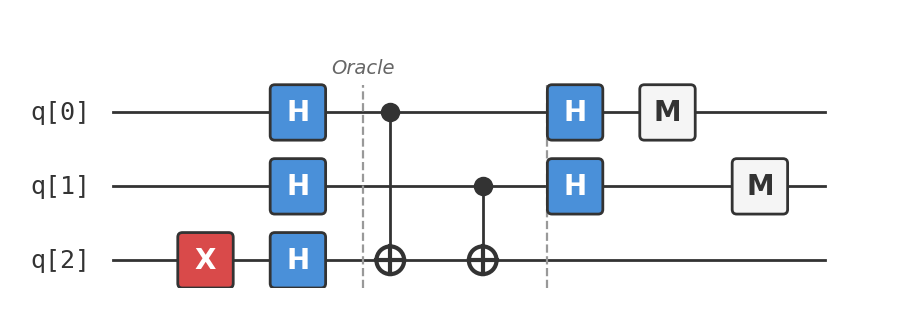
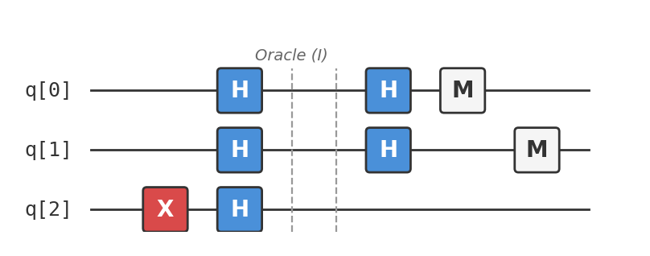

# Recipe 03: Deutsch-Jozsa

## What are we making?

An algorithm that answers a yes-or-no question with a single query — where any classical algorithm might need exponentially many. Given a black-box function $f$ that maps $n$-bit strings to 0 or 1, and the promise that $f$ is either **constant** (same output for all inputs) or **balanced** (outputs 0 for exactly half the inputs and 1 for the other half), determine which type it is.

Classically, you'd need to check up to $2^{n-1} + 1$ inputs in the worst case. The Deutsch-Jozsa algorithm does it in **one query**. This is your first taste of an exponential quantum speedup.

## Ingredients

- 3 qubits (2 input + 1 ancilla)
- Hadamard gates (`h`)
- CNOT gates (`cx`)
- 1 X gate (`x`)
- A [Quokka](https://www.quokkacomputing.com/) (puck or app)

**Prerequisites:** [Recipe 01 — Bell State](../01-bell-state/README.md). You should be comfortable with superposition and what the Hadamard gate does.

## Background: oracles and the power of asking in superposition

Imagine a room with a locked box. Inside is a function $f$ that takes a 2-bit input ($00$, $01$, $10$, or $11$) and returns a single bit ($0$ or $1$). You're told one of two things:

- **Constant:** $f$ returns the same value for every input (e.g., always 0)
- **Balanced:** $f$ returns 0 for exactly two inputs and 1 for the other two

You can query the box: give it an input, get the output. The question: **is $f$ constant or balanced?**

Classically, in the worst case you check three inputs. If the first two outputs agree, you still don't know — maybe the function is balanced and you got unlucky. You need a third query to be sure.

Quantum mechanically, you can query *all inputs simultaneously* using superposition. The Deutsch-Jozsa algorithm does this and extracts the answer from the interference pattern in a single query.

### What's an oracle?

An oracle is a quantum gate that computes a classical function *reversibly*. For a function $f: \{0,1\}^n \rightarrow \{0,1\}$, the oracle acts as:

$$U_f |x\rangle|y\rangle = |x\rangle|y \oplus f(x)\rangle$$

The input $|x\rangle$ is unchanged; the output qubit $|y\rangle$ gets flipped if $f(x) = 1$. This is reversible (apply it twice and you get back the original state), which is a requirement for quantum gates.

## Method

We'll run the algorithm for $n = 2$ (two input bits). We provide *two* QASM files: one with a balanced oracle, one with a constant oracle. The algorithm correctly identifies each.

### Step 1: Prepare the ancilla

Start by putting the output qubit (q[2]) into the $|{-}\rangle$ state:

```
x q[2];
h q[2];
```

This creates $|{-}\rangle = \frac{1}{\sqrt{2}}(|0\rangle - |1\rangle)$.

Why? This is the **phase kickback trick**. When the oracle flips the ancilla (because $f(x) = 1$), the minus sign in $|{-}\rangle$ gets kicked back as a *phase* on the input register:

$$U_f |x\rangle|{-}\rangle = (-1)^{f(x)} |x\rangle|{-}\rangle$$

The ancilla doesn't change — but the input picks up a phase of $-1$ whenever $f(x) = 1$. This converts the oracle from flipping a bit to marking amplitudes, which is exactly what we need for interference.

### Step 2: Create superposition over all inputs

Apply Hadamard to each input qubit:

```
h q[0];
h q[1];
```

The input register is now in an equal superposition of all four inputs:

$$|{+}{+}\rangle = \frac{1}{2}(|00\rangle + |01\rangle + |10\rangle + |11\rangle)$$

Combined with the ancilla, the full state is:

$$\frac{1}{2}(|00\rangle + |01\rangle + |10\rangle + |11\rangle) \otimes |{-}\rangle$$

### Step 3: Apply the oracle

This is where the two versions diverge.

#### Constant oracle: $f(x) = 0$ for all $x$

```
// Do nothing — the constant-zero oracle is the identity
```

Since $f(x) = 0$ for all inputs, the oracle never flips the ancilla. The state is unchanged. Every amplitude keeps its original sign.

#### Balanced oracle: $f(x) = x_0 \oplus x_1$

```
cx q[0], q[2];
cx q[1], q[2];
```

This implements $f(x) = x_0 \oplus x_1$ (XOR of the two input bits). It returns 1 when the inputs differ ($01$ and $10$) and 0 when they match ($00$ and $11$) — exactly half and half, so it's balanced.

Using the phase kickback, the state becomes:

$$\frac{1}{2}((-1)^{f(00)}|00\rangle + (-1)^{f(01)}|01\rangle + (-1)^{f(10)}|10\rangle + (-1)^{f(11)}|11\rangle) \otimes |{-}\rangle$$

For $f(x) = x_0 \oplus x_1$: $f(00) = 0$, $f(01) = 1$, $f(10) = 1$, $f(11) = 0$:

$$\frac{1}{2}(|00\rangle - |01\rangle - |10\rangle + |11\rangle) \otimes |{-}\rangle$$

### Step 4: Apply Hadamard to the input register

```
h q[0];
h q[1];
```

The Hadamard transform converts the phase pattern into an amplitude pattern. This is where interference does the heavy lifting.

**Constant case:** all signs positive → Hadamard maps back to $|00\rangle$. Constructive interference on $|00\rangle$, destructive on everything else.

**Balanced case:** the signs $+, -, -, +$ form a pattern that the Hadamard maps to $|11\rangle$. Constructive interference on $|11\rangle$, destructive on $|00\rangle$.

!!! info "The math in detail"
    For the balanced oracle, the input register before the final Hadamard is:

    $$\frac{1}{2}(|00\rangle - |01\rangle - |10\rangle + |11\rangle) = \frac{1}{2}(|0\rangle - |1\rangle)(|0\rangle - |1\rangle) = |{-}{-}\rangle$$

    Applying $H \otimes H$:

    $$H|{-}\rangle \otimes H|{-}\rangle = |1\rangle \otimes |1\rangle = |11\rangle$$

    For the constant oracle, the input register is:

    $$\frac{1}{2}(|00\rangle + |01\rangle + |10\rangle + |11\rangle) = |{+}{+}\rangle$$

    Applying $H \otimes H$:

    $$H|{+}\rangle \otimes H|{+}\rangle = |0\rangle \otimes |0\rangle = |00\rangle$$

### Step 5: Measure

```
measure q[0] -> c[0];
measure q[1] -> c[1];
```

The decision rule is simple:

- **All zeros** ($|00\rangle$) → $f$ is **constant**
- **Anything else** → $f$ is **balanced**

No probability, no statistics, no repeated runs needed. One shot, deterministic answer.

## The complete circuits

### Balanced oracle ($f(x) = x_0 \oplus x_1$)

Available as [`deutsch_jozsa_balanced.qasm`](deutsch_jozsa_balanced.qasm):

```
OPENQASM 2.0;
include "qelib1.inc";

qreg q[3];
creg c[2];

x q[2];
h q[2];

h q[0];
h q[1];

// Oracle: f(x) = x0 XOR x1
cx q[0], q[2];
cx q[1], q[2];

h q[0];
h q[1];

measure q[0] -> c[0];
measure q[1] -> c[1];
```

### Constant oracle ($f(x) = 0$)

Available as [`deutsch_jozsa_constant.qasm`](deutsch_jozsa_constant.qasm):

```
OPENQASM 2.0;
include "qelib1.inc";

qreg q[3];
creg c[2];

x q[2];
h q[2];

h q[0];
h q[1];

// Oracle: f(x) = 0 (do nothing)

h q[0];
h q[1];

measure q[0] -> c[0];
measure q[1] -> c[1];
```

As circuit diagrams:

**Balanced** ($f(x) = x_0 \oplus x_1$):



**Constant** ($f(x) = 0$):



## Taste test

### Run the balanced oracle

Paste `deutsch_jozsa_balanced.qasm` into your Quokka. You should see:

```
{'11': 1024}
```

Result is `11` — **not all zeros** — so the function is **balanced**. Correct!

### Run the constant oracle

Paste `deutsch_jozsa_constant.qasm` into your Quokka. You should see:

```
{'00': 1024}
```

Result is `00` — **all zeros** — so the function is **constant**. Correct!

Both answers are deterministic — you get the right answer with 100% probability in a single query. A classical algorithm would need up to 3 queries for $n = 2$, and up to $2^{n-1} + 1$ queries in general.

## Deep dive

??? abstract "General $n$-qubit proof of correctness"

    The recipe demonstrates $n = 2$, but the algorithm works for any $n$. Here is the general proof.

    **Setup:** $n$ input qubits initialised to $|0\rangle$ and one ancilla initialised to $|1\rangle$.

    **Step 1 — Prepare $|{-}\rangle$ on the ancilla and $H^{\otimes n}|0\rangle^{\otimes n}$ on the input:**

    $$|0\rangle^{\otimes n}|1\rangle \xrightarrow{H^{\otimes (n+1)}} \left(\frac{1}{\sqrt{2^n}} \sum_{x \in \{0,1\}^n} |x\rangle\right) \otimes |{-}\rangle$$

    **Step 2 — Apply the oracle $U_f$:**

    Using the phase kickback identity $U_f|x\rangle|{-}\rangle = (-1)^{f(x)}|x\rangle|{-}\rangle$:

    $$\frac{1}{\sqrt{2^n}} \sum_{x} (-1)^{f(x)} |x\rangle \otimes |{-}\rangle$$

    **Step 3 — Apply $H^{\otimes n}$ to the input register.**

    The key identity: $H^{\otimes n}|x\rangle = \frac{1}{\sqrt{2^n}} \sum_{z} (-1)^{x \cdot z} |z\rangle$, where $x \cdot z = \bigoplus_i x_i z_i$ is the bitwise inner product modulo 2.

    So:

    $$H^{\otimes n} \left[\frac{1}{\sqrt{2^n}} \sum_{x} (-1)^{f(x)} |x\rangle\right] = \sum_{z} \left[\frac{1}{2^n} \sum_{x} (-1)^{f(x) + x \cdot z}\right] |z\rangle$$

    **Step 4 — Measure.** The probability of outcome $|0\rangle^{\otimes n}$ is:

    $$\Pr(0^n) = \left|\frac{1}{2^n} \sum_{x} (-1)^{f(x)}\right|^2$$

    **Constant case:** $f(x) = c$ for all $x$. Then $\sum_x (-1)^c = (-1)^c \cdot 2^n$, so $\Pr(0^n) = |(-1)^c|^2 = 1$.

    **Balanced case:** Exactly half the $(-1)^{f(x)}$ terms are $+1$ and half are $-1$, so $\sum_x (-1)^{f(x)} = 0$, giving $\Pr(0^n) = 0$.

    Therefore: measure $0^n$ → constant; measure anything else → balanced. The answer is always deterministic and always correct. ∎

??? abstract "The Hadamard transform as a Fourier transform over $\mathbb{Z}_2^n$"

    The $n$-qubit Hadamard transform $H^{\otimes n}$ is the **discrete Fourier transform over the group $\mathbb{Z}_2^n$** (the group of $n$-bit strings under bitwise XOR).

    For a function $g: \{0,1\}^n \rightarrow \mathbb{C}$ encoded in the amplitudes of a quantum state $|\psi\rangle = \sum_x g(x)|x\rangle$, applying $H^{\otimes n}$ gives:

    $$H^{\otimes n}|\psi\rangle = \sum_z \hat{g}(z)|z\rangle$$

    where $\hat{g}(z) = \frac{1}{\sqrt{2^n}} \sum_x (-1)^{x \cdot z} g(x)$ is the **Walsh-Hadamard transform** of $g$.

    This is a Fourier transform with characters $\chi_z(x) = (-1)^{x \cdot z}$ over $\mathbb{Z}_2^n$. The key properties:

    1. **Parseval's theorem:** $\sum_z |\hat{g}(z)|^2 = \sum_x |g(x)|^2$ (probabilities are preserved)

    2. **Convolution theorem:** Convolution in the $x$-domain becomes pointwise multiplication in the $z$-domain

    3. **Self-inverse:** $H^{\otimes n} \cdot H^{\otimes n} = I$ (the Fourier transform over $\mathbb{Z}_2^n$ is its own inverse up to normalisation)

    **Why this matters for Deutsch-Jozsa:** After the oracle, the amplitudes encode $(-1)^{f(x)} / \sqrt{2^n}$. The Hadamard transform converts this into the Fourier domain. For a constant function, all the energy concentrates at the zero frequency ($z = 0^n$). For a balanced function, the zero frequency vanishes completely. The measurement distinguishes these two cases.

    This Fourier perspective generalises: Bernstein-Vazirani uses the same transform to read off a hidden linear function, and Simon's algorithm uses it to find a hidden period. The Quantum Fourier Transform (QFT) generalises to $\mathbb{Z}_N$, powering Shor's algorithm.

??? abstract "Phase kickback: why it works, formally"

    The phase kickback trick is arguably the single most important technique in quantum computing. Let's derive it cleanly.

    **Setting:** An oracle $U_f$ acts on $n + 1$ qubits:

    $$U_f|x\rangle|y\rangle = |x\rangle|y \oplus f(x)\rangle$$

    **Claim:** If the ancilla is in state $|{-}\rangle = \frac{1}{\sqrt{2}}(|0\rangle - |1\rangle)$, then:

    $$U_f|x\rangle|{-}\rangle = (-1)^{f(x)}|x\rangle|{-}\rangle$$

    **Proof:**

    $$U_f|x\rangle|{-}\rangle = |x\rangle \otimes U_f^{(x)}|{-}\rangle$$

    where $U_f^{(x)}$ flips the ancilla if $f(x) = 1$ and does nothing if $f(x) = 0$.

    **Case $f(x) = 0$:**

    $$|{-}\rangle \xrightarrow{\text{no flip}} |{-}\rangle = (-1)^0 |{-}\rangle$$

    **Case $f(x) = 1$:**

    $$|{-}\rangle = \frac{1}{\sqrt{2}}(|0\rangle - |1\rangle) \xrightarrow{X} \frac{1}{\sqrt{2}}(|1\rangle - |0\rangle) = -\frac{1}{\sqrt{2}}(|0\rangle - |1\rangle) = -|{-}\rangle = (-1)^1|{-}\rangle$$

    In both cases: $U_f|x\rangle|{-}\rangle = (-1)^{f(x)}|x\rangle|{-}\rangle$. ∎

    **The key insight:** The ancilla is an eigenvector of the X gate with eigenvalue $-1$. When the oracle conditionally applies X, the eigenvalue "kicks back" as a phase onto the control register. The ancilla ends in exactly the same state — it acts as a catalyst.

    This works for any unitary $U$ with eigenstate $|u\rangle$ and eigenvalue $e^{i\theta}$: controlled-$U$ on $|x\rangle|u\rangle$ gives $e^{ix\theta}|x\rangle|u\rangle$. This generalisation is the foundation of **quantum phase estimation**, which powers Shor's algorithm.

??? abstract "Complexity-theoretic significance: BPP, BQP, and EQP"

    Deutsch-Jozsa is often dismissed as "not useful in practice" because a classical randomised algorithm solves it efficiently: query $f$ a few times, and if you ever see both 0 and 1, it's balanced; if all queries agree, guess constant. With $O(1)$ queries, the error probability is exponentially small.

    So why does Deutsch-Jozsa matter? Because of what it says about **deterministic** query complexity.

    **Query complexity classes:**

    | Class | Description | Deutsch-Jozsa queries |
    |:---|:---|:---|
    | Deterministic classical | Must be correct with certainty | $2^{n-1} + 1$ |
    | Randomised classical (BPP) | Correct with high probability | $O(1)$ |
    | Quantum exact (EQP) | Correct with certainty, quantum | $1$ |
    | Quantum bounded-error (BQP) | Correct with high probability, quantum | $1$ |

    Deutsch-Jozsa proves that **EQP $\neq$ deterministic P** in the query model — quantum computers with certainty can beat deterministic classical computers exponentially. This was the first formal evidence that quantum computers are more powerful.

    **The deeper point:** The algorithm demonstrates that quantum parallelism + interference can extract *global properties* of a function (constant vs. balanced) from a single query, whereas classical deterministic algorithms must probe the function locally, one input at a time. This principle — extracting global structure from interference — is the engine behind all quantum speedups.

    Bernstein-Vazirani tightens this further: the quantum algorithm finds a hidden $n$-bit string $s$ in 1 query; the classical deterministic lower bound is $n$ queries. Simon's algorithm then achieves an *exponential* quantum speedup even over randomness, bridging to Shor's algorithm.

??? abstract "Other oracle types: constant-1, and beyond XOR"

    Our recipe uses $f(x) = 0$ (constant) and $f(x) = x_0 \oplus x_1$ (balanced). Here are implementations for other cases, all on 2 input qubits.

    **Constant $f(x) = 1$:**

    The oracle needs to flip the ancilla for every input. But since the ancilla is in $|{-}\rangle$, this just adds a global phase of $-1$, which is unobservable. The circuit is the same as $f(x) = 0$ (identity oracle) — and the algorithm still correctly outputs $|00\rangle$.

    Alternatively, you can implement it explicitly: apply X to the ancilla unconditionally. The global phase makes no difference to the measurement.

    **Balanced $f(x) = x_0$ (depends on first bit only):**

    ```
    // Oracle: f(x) = x0
    cx q[0], q[2];
    ```

    The algorithm outputs $|10\rangle$ (non-zero → balanced). ✓

    **Balanced $f(x) = x_1$ (depends on second bit only):**

    ```
    // Oracle: f(x) = x1
    cx q[1], q[2];
    ```

    The algorithm outputs $|01\rangle$ (non-zero → balanced). ✓

    **Balanced $f(x) = x_0 \oplus x_1 \oplus 1$ (negated XOR):**

    ```
    // Oracle: f(x) = NOT(x0 XOR x1)
    cx q[0], q[2];
    cx q[1], q[2];
    x q[2];
    ```

    Since $f$ differs from the XOR oracle by a global NOT, the phase kickback differs by $(-1)^1 = -1$ on every term. This global phase doesn't affect the measurement — the algorithm outputs $|11\rangle$ (non-zero → balanced). ✓

    In general, for $n$ input bits there are $2$ constant functions and $\binom{2^n}{2^{n-1}}$ balanced functions. The algorithm distinguishes between these two classes in one query regardless of which specific function the oracle implements.

## Chef's notes

- **Is this speedup useful?** The Deutsch-Jozsa problem is artificial — nobody actually needs to distinguish constant from balanced functions. But the *technique* is real: querying in superposition and extracting information through interference is the engine behind every quantum algorithm. Think of this as the "Hello, World!" of quantum speedups.

- **Phase kickback is the key insight.** The ancilla trick ($|{-}\rangle$ turning bit flips into phase flips) appears everywhere in quantum computing. You'll see it again in Grover's algorithm, quantum phase estimation, and Shor's algorithm. Master it here and the rest becomes much easier.

- **Scaling up.** Our example uses $n = 2$ inputs, but the algorithm works for any $n$. For $n = 10$, a classical algorithm might need 513 queries. Deutsch-Jozsa still needs 1. The circuit is the same structure: $n$ Hadamards, oracle, $n$ Hadamards, measure.

- **The oracle hides the classical function.** In a real application, the oracle would be some complex quantum circuit implementing a function you can query but not inspect. Here we build the oracle ourselves (so we know the answer), but the algorithm doesn't use that knowledge — it discovers the answer from the interference pattern.

- **Bernstein-Vazirani is the next step.** If Deutsch-Jozsa asks "constant or balanced?", Bernstein-Vazirani asks "what's the hidden string?" — same circuit structure, deeper question. That's coming in a future recipe.

- **Why we provide two QASM files.** Unlike Recipes 01 and 02, this recipe has two circuits to run — one for each type of oracle. Run both and verify the algorithm gets the right answer each time. This is the best way to see that the same algorithm handles both cases correctly.
